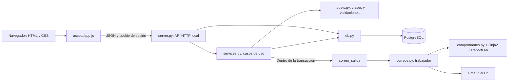

# 1. Descripción general del proyecto

**Proyecto:** ARENA CASTELL, cancha sintética de Amaguaña, Quito, Ecuador.  
**Responsable:** Johan Vivanco. El trabajo se está desarrollando de forma individual.  
**Fecha de esta auditoría:** 31 de agosto de 2026, zona `America/Guayaquil`.  
**Versión de referencia:** commit `07f71c3`, rama `main`.  
**Repositorio:** [johanvivancx/ARENACASTELL](https://github.com/johanvivancx/ARENACASTELL).

El sistema organiza tres servicios: reservas de cancha, inscripción de equipos en torneos y escuela de fútbol Súper Chaca. Cada cliente tiene una cuenta y un historial; el administrador consulta las operaciones del complejo. La finalidad es reunir estos registros y evitar problemas como reservas cruzadas, pagos duplicados o listas de jugadores que excedan el límite.

La aplicación local está implementada y tiene pruebas. Guarda datos en PostgreSQL y puede enviar correos reales mediante Gmail. **El registro de un pago todavía no realiza ni verifica un cobro bancario.** La base mantiene explícitamente ese alcance. El aspecto comercial de la página no cambia esta limitación técnica.

La dirección de GitHub Pages compartida por Johan corresponde a una publicación estática. El sistema completo funciona actualmente mediante el servidor Python local; no hay un despliegue de producción del backend documentado en el repositorio.

## Cómo interpretar este documento

- **Código:** información contrastada con los archivos actuales y sus dependencias. Es la referencia principal para explicar el comportamiento.
- **Git:** hechos observados en commits, referencias y estado del repositorio local.
- **Conversación:** solicitudes y confirmaciones anteriores de Johan. Se indican por separado cuando no equivalen a una comprobación actual del sistema.
- **Verificación anterior:** pruebas y revisiones realizadas durante el desarrollo y conservadas en `docs/VERIFICACION.md` y en el contexto de trabajo.
- **Auditoría actual:** revisión de archivos y metadatos, sin ejecutar operaciones sobre la base personal ni enviar correos.

Se inventariaron los **93 archivos versionados** anteriores a este documento: código, páginas, imágenes, plantilla de correo, SQL, pruebas y documentación. También se revisaron las referencias locales de Git, los nombres de variables de la plantilla de entorno y las versiones instaladas disponibles. No se leyó el contenido real de `.env`.

La carpeta de trabajo en la computadora original es `C:\Users\johan\OneDrive\Documentos\PROYECTOINTEGRADOR\arena-castell`. Esa ruta es solo una referencia histórica: en otra PC se debe usar la ubicación del nuevo clon. No es necesario trasladar las carpetas temporales de Codex.

# 2. Historia del desarrollo

La cronología combina la conversación con el historial que todavía puede consultarse localmente. No todos los cambios conservan un commit independiente en `main`: hubo una reorganización del historial.

| Etapa | Qué ocurrió | Evidencia y resultado actual |
|---|---|---|
| Planteamiento inicial | Se definieron reservas, torneos, escuela, cuentas, pagos, PostgreSQL y POO. La propuesta mencionaba Flask, Jinja2 para páginas, Cinzel/Montserrat y tonos azul oscuro/dorado. | Conversación. Era una propuesta; no describe la arquitectura actual. |
| Revisión del enfoque | Johan pidió HTML independientes y observó que la rúbrica no exige Flask. Se mantuvo Python para la lógica y la conexión con PostgreSQL. | Conversación y código. El backend usa `http.server`; no hay `app.py` ni Flask. |
| Primera implementación recuperable | Se prepararon la estructura, el esquema SQL, las clases, los servicios, la API, las páginas y las pruebas. | Historial local antiguo del 30/08/2026: `878426c`, `d9c20ed`, `b650eba`, `800d648`, `996499b`. No son la cadena de antecesores de `main` actual. |
| Ajustes iniciales | Se corrigieron contraste, formato del código, uso de `DOCTYPE` y envío de formularios para evitar credenciales en la URL. Se prepararon diagramas y documentación. | Referencias locales antiguas: `4709ad2`, `e0bca95`, `06fc823`; archivos actuales y pruebas HTML. |
| Cambio visual | Johan pidió una apariencia negra y elegante, letra más común y fotos de la cancha. Se sustituyeron ilustraciones decorativas por los recursos suministrados. | Conversación, `assets/styles.css`, imágenes y páginas actuales. La fuente es Arial; los acentos son plateados. |
| Contenido del negocio | Se añadieron parqueadero seguro, servicio de bar, flyers de Copa Castell y jornadas de Súper Chaca. La Copa ya había empezado y debía mostrarse sin aceptar nuevas inscripciones. | Conversación y `docs/CONTENIDO_FLYERS.md`. No confundir sus condiciones con las de Pasochoa Cup. |
| Organización de páginas | Se eliminaron variantes duplicadas con tildes, espacios o diferencias de mayúsculas. `index.html` pasó a la raíz y se ajustaron los enlaces. | Conversación y árbol actual: 19 páginas públicas, con 18 dentro de `pages/`. |
| Base, cuentas y administración | Se prepararon scripts independientes para pgAdmin, historial del cliente y panel del administrador. Johan fue ejecutando los pasos manualmente. | Conversación, `sql/pgadmin/`, API y pruebas. No se conoce por esta auditoría cada paso aplicado a la base personal. |
| Textos y correo | Se simplificó la documentación, se quitaron avisos generales de proyecto académico de la web y se añadió envío SMTP configurable con Gmail. | Conversación y código. El nombre `GIT_Y_COLABORACION.md` se reemplazó por `GIT_GITHUB.md`. Quedan textos técnicos antiguos identificados en la sección 15. |
| Tarifas y quinta edición | Se fijaron $27/hora, eventos a $30/hora y cumpleaños de exactamente 3 horas a $25/hora. Se añadieron fotos y el resumen de 800 niños premiados en la quinta Pasochoa Cup. | Conversación, modelo, HTML y migración `003`. Estos cambios están incluidos en `74e1859`. |
| Historial de Git | Se reemplazó el commit raíz anterior mediante `commit --amend` y un `push --force-with-lease` ejecutado por Johan. | Conversación. `74e1859` es hoy la raíz de `main`. Esta operación fue excepcional; no es el flujo cotidiano. |
| Sexta Pasochoa Cup | Johan pidió una convocatoria que empezara en un mes, con 16 equipos y $30 de inscripción. Se fijó el 30/09/2026, manteniendo hasta 20 jugadores. | Commit `4244c4c`, 31/08/2026. La fecha es fija, no se recalcula cada vez que se instala o abre la página. |
| Prueba de Gmail | Johan configuró una contraseña de aplicación y confirmó que recibió el correo de prueba. Después mostró una confirmación de inscripción recibida en texto simple. | Conversación. Confirma que el envío SMTP funcionó en la PC anterior; no se reproduce ninguna cuenta ni credencial aquí. |
| Nuevo diseño del correo | Se agregaron Jinja2 y ReportLab: correo HTML con logo incluido, versión de texto y comprobante PDF. Se actualizaron pruebas y guías. | Commit `07f71c3`, 31/08/2026. Es el último cambio funcional guardado. |
| Preparación del traslado | Johan pidió esta auditoría para continuar con otro Codex sin historial de conversación. | Este documento. No se autorizaron cambios de código, commits ni push durante la auditoría. |

La regla final de trabajo es que **Johan ejecuta manualmente Git y los scripts de pgAdmin**. Quiso probar Pull Requests, pero rechazó las ramas creadas para ese fin y pidió seguir directamente en `main`. No reconstruir un supuesto equipo ni crear nuevas ramas automáticamente.

# 3. Tecnologías utilizadas

| Tecnología | Versión comprobable | Función y configuración |
|---|---|---|
| Python | Se requiere 3.14; `.venv/pyvenv.cfg` indica 3.14.6 en la PC auditada. | Backend, POO, CLI, correo y PDF. `.python-version` contiene `3.14`. |
| PostgreSQL | SQL preparado para 18; el cliente `pg_dump` instalado informa 18.6. Las pruebas anteriores usaron 18.6. | Persistencia, restricciones, triggers, procedimiento y vistas. La versión exacta del servidor personal no se consultó durante esta auditoría. |
| pgAdmin4 | Versión exacta no recuperada. | Administración manual de PostgreSQL. No es el motor ni una dependencia del servidor web. |
| HTML5 | Sin paquete ni compilación. | 19 páginas públicas, con `DOCTYPE`, `lang="es"`, formularios y navegación. |
| CSS | CSS puro. | Diseño adaptable en `assets/styles.css`, Grid/Flexbox, foco visible e impresión. |
| JavaScript | Sin framework ni gestor de paquetes. | `assets/app.js`: API, formularios, estados, disponibilidad, historial y reportes. |
| `http.server` | Biblioteca estándar de Python. | `ThreadingHTTPServer` y `SimpleHTTPRequestHandler` en `server.py`. Uso local. |
| `psycopg[binary]` | 3.3.4 | Conexión PostgreSQL y consultas parametrizadas. |
| `python-dotenv` | 1.2.3 | Carga el `.env` de la raíz desde `db.py`. |
| Jinja2 | 3.1.6 | Plantilla HTML de correo con escape automático. No renderiza las páginas del sitio. |
| ReportLab | 5.0.1 | Creación de comprobantes PDF en memoria. |
| `tzdata` | 2026.3 | Datos de zona horaria para `ZoneInfo`, especialmente en Windows. |
| `smtplib`, `email`, `ssl` | Biblioteca estándar de Python. | SMTP, MIME, adjuntos y conexión TLS. No se usa Flask-Mail. |
| pytest | 9.1.1, fijado en dependencias de desarrollo. | Pruebas de lógica, BD, HTTP, correo y SQL. |
| pypdf | 6.16.2, fijado en dependencias de desarrollo. | Inspección de los PDF en las pruebas. |
| Git y GitHub | Sin versión mínima fijada en el proyecto. | Historial y repositorio remoto. |
| Visual Studio Code | Versión exacta no recuperada. | Editor y terminal. No sustituye PostgreSQL ni Python. |

Se encontraron instaladas las cinco dependencias principales con las versiones indicadas en el entorno del proyecto. El extra `psycopg[binary]` instala también la distribución binaria de psycopg. Las dependencias de desarrollo deben instalarse si se van a ejecutar pruebas. Los paquetes transitivos no tienen un archivo de bloqueo independiente.

No hay Node/npm, React, Flask, Django, SQLAlchemy, SQLite, Docker, `pyproject.toml`, `package.json` ni configuración de CI/CD en el repositorio actual.

# 4. Arquitectura actual

## 4.1 Componentes y comunicación



`server.py` sirve tanto los archivos públicos como `/api/...`. No se levantan dos servidores distintos para frontend y backend. La dirección habitual es `http://127.0.0.1:8765/`.

Los HTML son archivos independientes. El encabezado y el pie se repiten en cada página; **no existe `base.html`**. La carpeta `templates/` se usa exclusivamente para correos, no para cambiar este funcionamiento.

El JavaScript toma la raíz del sitio a partir de la ubicación del propio script y construye los enlaces con `pageHref()`. Las llamadas de datos se hacen a `/api` en el mismo origen mediante `fetch`, con `credentials: same-origin`. No hay datos de negocio persistidos en `localStorage` o `sessionStorage` ni una URL configurable para una API remota separada.

La base se consulta con conexiones cortas. `db.conectar()` usa filas tipo diccionario, espera de conexión de 5 segundos, zona `America/Guayaquil` y límite de consulta de 10 segundos. El contexto de conexión confirma la transacción al salir correctamente y la revierte si hay error.

## 4.2 Recorrido de una operación

1. El navegador obtiene sesión y catálogo. La sesión puede ser anónima para entregar el token CSRF.
2. El usuario inicia sesión o se registra. El registro público siempre crea un cliente.
3. El servicio calcula el importe en Python con los datos de la base; no acepta un precio decidido por el navegador.
4. Se crea una orden pendiente y su reserva, equipo o inscripción correspondiente.
5. Al registrar el pago se bloquea la orden, se revisan nuevamente las reglas y se inserta un único pago.
6. La reserva queda confirmada, el equipo confirmado o la inscripción activa. Para escuela y mensualidades se llama al procedimiento SQL.
7. La confirmación de correo se guarda en la misma transacción. El trabajador la envía después, desde otra conexión.
8. El cliente consulta el resultado en confirmación e historial; el administrador ve los reportes.

Una orden pendiente **no bloquea un horario ni consume un cupo confirmado**. La comprobación decisiva ocurre al pagar. No existe una pasarela que confirme dinero recibido antes de ese cambio de estado.

## 4.3 API existente

Todos los POST reciben JSON; usan `Content-Type: application/json`, sesión y cabecera `X-CSRF-Token`. El servidor limita el cuerpo a 32 KiB y comprueba el origen cuando está presente.

| Método y ruta | Función | Acceso |
|---|---|---|
| GET `/api/session` | Obtener usuario público y CSRF; crear sesión anónima si hace falta. | Público. |
| POST `/api/auth/register` | Registrar cuenta y abrir sesión. | Sesión anónima + CSRF. |
| POST `/api/auth/login` | Iniciar sesión y rotar el identificador de sesión. | Sesión + CSRF. |
| POST `/api/auth/logout` | Cerrar sesión y crear otra anónima. | Sesión + CSRF. |
| POST `/api/auth/forgot` | Solicitar recuperación sin revelar si existe el correo. | Sesión + CSRF. |
| POST `/api/auth/reset` | Cambiar contraseña mediante enlace válido. | Sesión + CSRF + token recibido en el cuerpo. |
| GET `/api/catalog` | Canchas, torneos visibles, jornadas activas y fechas válidas. | Público. |
| GET `/api/availability` | Horarios por `fecha`, `cancha` y `horas`. | Público. |
| POST `/api/reservations` | Crear orden y reserva pendiente. | Usuario autenticado. |
| POST `/api/tournaments` | Crear orden y equipo pendiente. | Usuario autenticado. |
| POST `/api/school` | Crear inscripción y mensualidad inicial. | Usuario autenticado. |
| GET `/api/orders/{uuid}` | Detalle de orden, pago, servicio y estado de correo. | Titular de la orden. |
| POST `/api/orders/{uuid}/pay` | Registrar pago sin duplicarlo. | Titular de la orden. |
| GET `/api/history` | Órdenes, escuela y últimos 20 avisos de operaciones. | Titular de la cuenta. |
| POST `/api/profile` | Actualizar nombre, teléfono, correo o cédula. | Titular; contraseña actual para correo/cédula. |
| GET `/api/teams/{id}` | Equipo y lista de jugadores. | Titular del equipo. |
| POST `/api/teams/{id}/players` | Agregar jugador. | Titular; inscripción confirmada y antes del inicio. |
| POST `/api/teams/{id}/remove` | Retirar jugador por `jugador_id`. | Titular, antes del inicio. |
| POST `/api/school/{id}/renew` | Crear o recuperar la orden de una mensualidad. | Titular de inscripción activa. |
| GET `/api/admin/reports` | Pagos, reservas, operaciones, escuela, ocupación y correos. | Administrador; `desde`/`hasta` filtran los pagos. |

No hay endpoints para crear torneos desde Admin, cambiar precios desde la web, aprobar transferencias, cancelar reservas, emitir reembolsos o descargar el PDF por HTTP. El PDF se adjunta al correo; la página ofrece impresión del comprobante HTML.

Los errores esperados se traducen a respuestas JSON: 400 para datos inválidos, 401 sin acceso, 403 por permiso/CSRF, 404 por recurso ajeno o inexistente, 409 por conflictos de integridad, 413 por tamaño de cuerpo no permitido, 429 por exceso de intentos y 503 por falta de conexión con PostgreSQL.

## 4.4 Clases y POO

`models.py` mantiene el dominio separado de HTTP y de SQL. `services.py` crea estas clases para validar datos y obtener costos antes de persistir una operación; no son ejemplos desconectados del funcionamiento.

| Clase | Comportamiento actual |
|---|---|
| `ErrorValidacion` | Excepción derivada de `ValueError`, con un mensaje que puede mostrarse en el formulario. |
| `Usuario` | Valida nombre, correo, cédula y celular. Encapsula `__password_hash`; expone `set_password()`, `get_password_hash()` y `verificar_password()`. `desde_fila()` reconstruye el subtipo según el rol guardado. |
| `Cliente` / `Administrador` | Heredan de `Usuario`. `puede_administrar()` devuelve un resultado distinto; `Administrador` también redefine la propiedad `rol`. |
| `ServicioArena` | Clase abstracta mediante `ABC`; exige `calcular_costo()` y utiliza ese método en `resumen_costo()`. |
| `ReservaCancha` | Encapsula horas, modalidad y tarifas. Valida duración y calcula tarifa por horas con dos decimales. |
| `InscripcionTorneo` | Valida tarifa positiva y límite de jugadores. Devuelve el costo de inscripción del torneo. |
| `InscripcionSuperChaca` | Valida edad y categoría según la fecha de ingreso. Su costo es la constante mensual de $50. |

La abstracción y el polimorfismo se ven en `ServicioArena` y sus tres implementaciones; la herencia también está en los tipos de usuario. El encapsulamiento corresponde a los atributos con doble guion bajo y sus métodos de acceso; no significa que todos los atributos de todas las clases sean privados. El diagrama existente está en `docs/ARQUITECTURA.md`.

## 4.5 Seguridad y entrega de correos

Las contraseñas admiten de 10 a 128 caracteres y se guardan con PBKDF2-HMAC-SHA256, 600.000 iteraciones y una sal aleatoria por contraseña. La comparación usa `hmac.compare_digest()`. La respuesta pública del usuario excluye el hash. La aplicación no consulta contraseñas en texto simple ni las envía por correo.

La cookie `arena_session` es HttpOnly y SameSite=Lax; dura 8 horas y añade Secure según la configuración. PostgreSQL conserva el hash SHA-256 del identificador de sesión y el token CSRF asociado. Iniciar sesión rota el identificador. El restablecimiento vence en 30 minutos, es de un solo uso y elimina las sesiones anteriores. `session_version` también se incrementa al restablecer, pero la invalidación efectiva del código actual es el borrado de las filas de sesión.

Registro, inicio de sesión y solicitud de recuperación tienen un límite de 10 intentos por IP y ruta durante 15 minutos. Ese contador se confirma en una transacción separada para que un acceso fallido no lo revierta. La protección por propietario se comprueba en los servicios, no solo ocultando botones. El administrador tiene reportes propios; eso no permite consultar cualquier orden mediante una ruta reservada al titular.

El servidor restringe los archivos públicos y envía cabeceras de seguridad, incluida una política de contenido. Las consultas SQL usan parámetros; el frontend escapa texto al construir contenido y la plantilla de correo usa escape automático de Jinja2. Estas medidas no sustituyen una revisión de seguridad antes de publicar el backend en Internet.

Los correos se guardan en `correo_salida`. Sus estados son LOCAL, PENDIENTE, ENVIADO, ERROR o CANCELADO. El trabajador de `correos.py` revisa pendientes aproximadamente cada 10 segundos, procesa lotes de hasta 10 y usa bloqueos de fila con `SKIP LOCKED` para no tomar el mismo mensaje desde dos trabajadores. Cada mensaje genera una parte de texto y una HTML; los comprobantes agregan logo CID y PDF, sin guardar un PDF temporal permanente.

`comprobantes.py` consulta la orden y el pago del titular, usa Jinja2 con `StrictUndefined` y prepara el PDF con ReportLab. Un error al renderizar se registra como `CONTENIDO_CORREO`: no revierte el pago ya confirmado ni envía un comprobante incompleto. Los riesgos de reenvío después de restaurar una base y las limitaciones de entrega están en las secciones 9 y 15.

## 4.6 Árbol de carpetas

```text
arena-castell/
├── CONTEXTO_PROYECTO.md              # Este documento, nuevo y sin commit
├── .env.example                     # Plantilla pública, sin claves personales
├── .gitignore
├── .python-version
├── README.md
├── INICIAR.md
├── index.html
├── db.py
├── models.py
├── services.py
├── server.py
├── manage.py
├── correos.py
├── comprobantes.py
├── requirements.txt
├── requirements-dev.txt
├── assets/
│   ├── app.js
│   ├── styles.css
│   ├── favicon.svg
│   └── 12 imágenes JPG/JPEG: logo, cancha, escuela, flyers y Pasochoa Cup
├── pages/                            # 18 páginas; lista en la sección 5
├── templates/
│   └── correos/mensaje.html
├── sql/
│   ├── schema.sql
│   ├── seed.sql
│   ├── permisos.sql
│   ├── migrations/                   # 001, 002, 003 y 004
│   └── pgadmin/                      # Pasos 01 a 13 y LEEME.md
├── tests/                            # conftest.py y 9 módulos de pruebas
└── docs/
    ├── ACCESIBILIDAD.md
    ├── ARQUITECTURA.md
    ├── CONTENIDO_FLYERS.md
    ├── CORREOS_GMAIL.md
    ├── DIAGRAMA_ENTIDAD_RELACION.md
    ├── DIAGRAMA_ENTIDAD_RELACION.pdf
    ├── GIT_GITHUB.md
    ├── PAGINAS.md
    ├── PGADMIN_PASO_A_PASO.md
    ├── RUBRICA.md
    ├── SEGURIDAD_Y_RESPALDOS.md
    ├── SUSTENTACION.md
    └── VERIFICACION.md
```

`.env`, `.venv/`, cachés, `instance/` y `backups/` son locales o están ignorados. No forman parte de los 93 archivos versionados. No hay `AGENTS.md`, `.vscode/`, `.github/` ni configuración de alojamiento Sites en el árbol auditado.

# 5. Explicación de archivos importantes

## Backend y recursos compartidos

| Archivo | Responsabilidad y relación con los demás |
|---|---|
| `db.py` | Carga el entorno y expone `conectar()`. No inicializa tablas automáticamente. |
| `models.py` | Valida datos, representa usuarios y servicios y calcula importes con `Decimal`. No contiene consultas SQL. |
| `services.py` | Casos de uso y transacciones: autenticación, reservas, equipos, alumnos, pagos, historial, perfil y reportes. Une clases y SQL. |
| `server.py` | Sirve archivos permitidos, resuelve rutas y comprueba sesión/CSRF. Inicia el trabajador de correo si está habilitado. |
| `manage.py` | Comandos locales de diagnóstico, creación de administrador, catálogo y correo. Algunos modifican datos: revisar la sección 21. |
| `correos.py` | Configuración SMTP, cola, reintentos, MIME y entrega a Gmail. No almacena contraseñas en el mensaje ni en los errores de la cola. |
| `comprobantes.py` | Lee el pago del titular, prepara el contexto del correo, renderiza Jinja2 y crea el PDF con ReportLab. |
| `templates/correos/mensaje.html` | HTML de correo con estilos incorporados, tablas, logo, detalles, total y botón. No usa JavaScript. |
| `assets/app.js` | Detecta `body[data-page]`, conecta formularios, carga datos y construye tablas/listas con escape del texto. |
| `assets/styles.css` | Tema negro/plateado, Arial, componentes, puntos de adaptación e impresión. Incluye reducción de movimiento y foco visible. |
| `.env.example` | Enumera la configuración que cada computadora debe completar localmente. No copiar claves reales a esta plantilla. |
| `.gitignore` | Evita agregar el entorno y ciertos directorios privados. No sustituye la revisión del contenido de cada commit. |

## Páginas

| Archivo | Contenido y siguiente paso |
|---|---|
| `index.html` | Información de la cancha, parqueadero, servicios, fotos, contactos y mapa de referencia. |
| `pages/reservas.html` | Tarifas y condiciones de hora, cumpleaños y evento. Dirige al formulario. |
| `pages/informacion_reservas.html` | Titular, modalidad, cancha, fecha, duración y horarios disponibles. Dirige a pago. |
| `pages/torneos.html` | Sexta Pasochoa Cup, Copa Castell en juego y galería de la quinta Pasochoa Cup. |
| `pages/pagos_torneos.html` | Selección de torneo, representante, equipo y aceptación de condiciones. |
| `pages/informacion_torneos_pago.html` | Revisión de la orden del equipo antes de pagar. |
| `pages/super_chaca.html` | Información de la escuela, edades, jornadas y flyers. |
| `pages/informacion_super_chaca.html` | Datos del alumno, categoría y jornada preferida. |
| `pages/pagos.html` | Registro del método de pago para todos los servicios; sin campos de tarjeta o CVV. |
| `pages/confirmacion.html` | Resultado del servicio, estado del correo y comprobante imprimible. Se muestra después de validar la orden pagada. |
| `pages/iniciar_sesion.html` | Acceso y enlaces a registro/recuperación. |
| `pages/registrarse.html` | Nombre, cédula, teléfono, correo, contraseña, confirmación y consentimiento. |
| `pages/olvide_contrasena.html` | Solicitud de recuperación. |
| `pages/restablecer_contrasena.html` | Nueva contraseña; toma el token del fragmento de URL y luego lo elimina de la dirección. |
| `pages/mi_perfil.html` | Datos de la cuenta y actualización. El cambio de contraseña sigue el recorrido de recuperación. |
| `pages/mis_reservas_inscripciones.html` | Filtros del historial, mensualidades, avisos y acceso a equipos/comprobantes. |
| `pages/mi_equipo.html` | Agregar y retirar jugadores dentro del plazo y límite del torneo. |
| `pages/admin.html` | Reportes de consulta y exportación CSV de pagos. No es todavía un CRUD completo. |
| `pages/privacidad.html` | Uso de datos, tratamiento del correo por Google y mapa externo. No constituye por sí sola una revisión legal. |

Los parámetros de navegación principales son `orden`, `equipo`, `torneo`, `tipo` y `next`. `safeNext()` limita la redirección a páginas del mismo sitio. Las páginas antiguas con el nombre canónico en la raíz tienen una redirección 301 a `pages/`; esto no recrea archivos duplicados ni garantiza variantes antiguas con tildes.

## Imágenes y documentación

Las 12 imágenes son `logo-arena-castell.jpg`, `cancha-real.jpeg`, `torneo-en-juego.jpeg`, `familia-chaca.jpg`, `copa-castell-flyer.jpg`, `chaca-horario-matutino.jpg`, `super-chaca-programas.jpg` y cinco imágenes con prefijo `pasochoa-`. Se guardaron dentro del proyecto para que los enlaces no dependan de Downloads. Los flyers suministrados se conservan; la instrucción de quitar ilustraciones anteriores no significa borrar estos materiales solicitados después.

`docs/DIAGRAMA_ENTIDAD_RELACION.md` contiene el modelo Mermaid y su PDF tiene cuatro páginas: reservas/pagos, torneos, escuela y acceso/correos. El diagrama de clases está en `docs/ARQUITECTURA.md`. Las guías de pgAdmin, Gmail, Git, accesibilidad, seguridad, sustentación y verificación explican cada área; las diferencias detectadas con el estado actual se enumeran en la sección 15.

Los PDF originales de la rúbrica y Diseño Universal estaban en Downloads de la PC anterior; **no están versionados**. Si se necesitan en la otra PC, hay que llevarlos aparte. El antiguo `implementation_plan.md` tampoco forma parte del repositorio ni debe reemplazar las decisiones posteriores.

# 6. Base de datos

## 6.1 Motor, conexión y alcance

La base habitual se llama `arena_castell`, dentro de PostgreSQL. `DATABASE_URL` indica servidor, puerto, base y rol de conexión. Los roles `CLIENTE` y `ADMIN` son de la aplicación y se guardan en `usuarios.rol`; no son cuentas independientes de PostgreSQL.

La conexión local que Johan mostró anteriormente funcionaba con el rol PostgreSQL `postgres`. En esta auditoría no se inició sesión en esa base: no se conocen su contenido actual, los permisos efectivos ni la lista exacta de migraciones ejecutadas. No se debe reemplazar ni reinicializar para averiguarlo.

## 6.2 Tablas y atributos

Las claves numéricas se generan mediante `IDENTITY`; las órdenes usan UUID. Importes: `numeric` en SQL y `Decimal` en Python, no cálculos monetarios con coma flotante en el backend.

| Tabla | Atributos principales | Relaciones y restricciones relevantes |
|---|---|---|
| `usuarios` | `id`, `nombre`, `cedula`, `email`, `telefono`, `password_hash`, `rol`, `session_version`, `creado_en` | Cédula y correo únicos; correo en minúsculas; celular de 10 dígitos iniciado en 09; rol predeterminado CLIENTE. |
| `canchas` | `id`, `nombre`, `tarifa_hora`, `tarifa_evento`, `tarifa_cumpleanos` | Nombre único y tarifas positivas. El catálogo inicial carga una cancha. |
| `torneos` | `id`, `nombre`, `descripcion`, `fecha_inicio`, `costo`, `cupos`, `max_jugadores`, `visible`, `abierto` | Nombre único, costo positivo, cupos entre 2 y 64, máximo de jugadores entre 1 y 20. |
| `ordenes` | `id`, `usuario_id`, `tipo`, `descripcion`, `monto`, `estado`, `creado_en` | FK al usuario; tipos RESERVA/TORNEO/ESCUELA/MENSUALIDAD; estados PENDIENTE/PAGADA/CANCELADA. |
| `reservas` | `id`, `orden_id`, `cancha_id`, `tipo_evento`, `inicio`, `fin`, `estado` | Orden única y FK a cancha. Duración entera de hasta 6 horas. Exclusión de horarios confirmados. |
| `equipos` | `id`, `orden_id`, `torneo_id`, `nombre`, `estado` | Orden única; nombre único por torneo sin distinguir mayúsculas mientras no esté cancelado. |
| `jugadores` | `id`, `equipo_id`, `nombre`, `cedula`, `posicion` | FK al equipo; cédula y posición únicas dentro de ese equipo; posición de 1 a 20. |
| `horarios_chaca` | `id`, `categoria`, `dias`, `activo`, `inicio`, `fin` | Categorías Sub-6 a Sub-18; horario final posterior al inicial; combinaciones únicas. |
| `inscripciones_chaca` | `id`, `orden_id`, `alumno`, `cedula`, `nacimiento`, `fecha_inscripcion`, `categoria`, `horario_id`, `estado` | Orden y cédula únicas; edad de ingreso de 4 a 17; FK compuesta de horario y categoría. |
| `mensualidades` | `id`, `orden_id`, `inscripcion_id`, `periodo` | Orden única; una fila por alumno y período; el período se guarda con el día 1. |
| `pagos` | `id`, `orden_id`, `monto`, `metodo`, `referencia`, `simulado`, `pagado_en` | Un pago por orden y referencia única. `simulado` tiene DEFAULT true y CHECK que exige true. |
| `correo_salida` | `id`, `usuario_id`, `orden_id`, `asunto`, `cuerpo`, `creado_en`, `destinatario`, `estado_envio`, `intentos`, `proximo_intento`, `enviado_en`, `ultimo_error`, `vence_en` | Orden opcional para recuperación; combinación orden/asunto única; índice de mensajes pendientes. |
| `restablecimientos` | `token_hash`, `usuario_id`, `vence_en`, `usado` | Token almacenado como hash; FK al usuario. |
| `intentos_acceso` | `clave`, `intentos`, `inicio` | Cuenta intentos por hash de IP y ruta; no necesita usuario registrado. |
| `sesiones` | `token_hash`, `usuario_id`, `csrf_token`, `vence_en` | Usuario opcional para sesiones anónimas; vence en 8 horas; FK con borrado en cascada al eliminar usuario. |

Relaciones centrales: un usuario tiene muchas órdenes; una orden tiene como máximo un pago y una fila de cada subtipo asociado. Un torneo tiene muchos equipos y cada equipo muchos jugadores. Una inscripción tiene muchas mensualidades. No hay tabla independiente de representantes: se utiliza el usuario titular de la orden.

Los tipos y estados se expresan con texto y CHECK, no con enums de PostgreSQL. La exclusividad lógica entre subtipos de orden la organiza la capa de servicios; no hay un trigger general que compruebe todas las combinaciones posibles introducidas manualmente por SQL.

## 6.3 Funciones, triggers, procedimiento y vistas

| Elemento | Regla implementada |
|---|---|
| Extensión `btree_gist` | Permite combinar cancha e intervalo en la restricción de exclusión. |
| `validar_cedula(text)` | Diez dígitos, provincia 01–24, tercer dígito 0–5 y módulo 10. Está también en Python y JavaScript. No consulta el Registro Civil ni confirma identidad real. |
| `controlar_reserva` / `trg_controlar_reserva` | Fecha futura dentro de 90 días, horas completas entre 08:00 y 23:00, mismo día, cumpleaños nuevos de exactamente 3 horas y rechazo de cruces confirmados. |
| `reservas_sin_solapamiento` | Exclusión GiST sobre cancha y `tstzrange(inicio,fin,'[)')` para reservas confirmadas. Permite reservas consecutivas y protege también ante concurrencia. |
| `controlar_cupo_torneo` / `trg_cupo_torneo` | Bloquea el torneo al confirmar; comprueba fecha, apertura y cupos. |
| `limitar_jugadores` / `trg_limitar_jugadores` | Exige equipo confirmado, asigna posición libre y aplica el límite de ese torneo. |
| `proteger_limite_torneo` / `trg_proteger_limite` | Impide reducir el máximo si ya existen jugadores en posiciones superiores. |
| `validar_pago` / `trg_validar_pago` | Exige que el pago insertado corresponda al monto de una orden pendiente. |
| `cobrar_mensualidad(uuid,text)` | Valida orden de escuela/mensualidad por $50, período permitido y cuota; inserta pago, marca orden pagada y activa inscripción. Repetir una orden ya pagada no duplica el pago. |
| `vista_reporte_administrador` | Pagos con usuario, orden y detalles de cancha, torneo/equipo o alumno/período. |
| `vista_mensualidades_escuela` | Cuotas pagadas, importe acumulado, último período y estado del mes actual. |
| `vista_ocupacion_cancha` | Reservas confirmadas, horas e importes por cancha y mes. |

Hay **15 tablas, 5 triggers propios, 6 funciones propias y 1 procedimiento**, además de 3 vistas. No contar las funciones que instala la extensión como funciones desarrolladas para el proyecto.

La API bloquea la cancha antes de confirmar una reserva y el torneo antes de confirmar un equipo. Esto mantiene el orden de bloqueo y complementa las restricciones SQL. La categoría del alumno se calcula con la edad al inscribirse y se conserva como dato histórico para futuras mensualidades.

El procedimiento SQL no envía correos por sí mismo. La confirmación se encola desde `services.pagar()`; ejecutar un CALL manual no recorre automáticamente toda la lógica HTTP y de correo.

## 6.4 Catálogo actual en los scripts

| Concepto | Valor actual |
|---|---|
| Cancha por hora | $27/hora; de 1 a 6 horas. |
| Evento deportivo | $30/hora; de 1 a 6 horas. |
| Cumpleaños | Exactamente 3 horas a $25/hora: $75. Incluye decoración. Otras duraciones se consultan fuera del formulario. |
| Servicios de la sede | Parqueadero privado y seguro, servicio de bar; consumo de comida/bebida aparte. |
| Copa Castell · Mundial de Campeones | Inicio 28/08/2026, en juego y cerrada; fútbol 7, $25/equipo, máximo 15 jugadores, premio anunciado de $300 + trofeo. |
| Cupo de Copa Castell | El script contiene 16 equipos, pero ese dato no fue confirmado como condición real de esa Copa. |
| Pasochoa Cup · Quinta edición | Galería y resumen de 800 niños premiados. Contenido informativo; no una convocatoria abierta cargada en SQL. |
| Pasochoa Cup · Sexta edición | Inicio fijo 30/09/2026, 16 equipos, $30/equipo, máximo 20 jugadores, visible y abierta en la carga inicial. |
| Súper Chaca | De 4 a 17 años, Sub-6 a Sub-18; mensualidad de $50 y sin cargo adicional de inscripción en el flujo actual. |
| Jornadas | Matutina 08:30–09:45, días por confirmar; vespertina lunes a viernes 15:00–18:30, distribución por grupo por confirmar. |

Son valores de los archivos, no una lectura del catálogo vivo. No se deben cambiar tarifas históricas en las órdenes para hacerlas coincidir con una nueva tarifa. La mensualidad de $50 procede de la especificación, no de un precio visible en los flyers.

## 6.5 Scripts y migraciones

| Archivo o grupo | Uso correcto |
|---|---|
| `sql/pgadmin/01_crear_base.sql` | Crear una base que no existe. Ejecutar desde `postgres`, fuera de una transacción. |
| Pasos `02` a `06` | Crear extensión/función, tablas, triggers, procedimiento y vistas, en ese orden y sobre `arena_castell`. |
| `07_catalogo.sql` | Cargar la cancha, las dos convocatorias del catálogo y 14 jornadas por categoría. También actualiza tarifas de la cancha existente. |
| `08_datos_de_prueba_opcionales.sql` | Personas y operaciones ficticias. Solo si se desean esos ejemplos y una sola vez. Contiene credenciales de demostración públicas; no se reproducen aquí. |
| `09_call_y_consultas.sql` | Demostración de CALL con los datos del paso 08. Modifica datos; no es solo diagnóstico. |
| `10_comprobar_validaciones.sql` | Consultas sobre validación y objetos creados, sin registrar personas. |
| `11_actualizar_correo_smtp.sql` | Agregar columnas e índice de la cola a una versión anterior. |
| `12_actualizar_tarifas_reservas.sql` | Actualizar precios y regla de cumpleaños, preservando órdenes y pagos anteriores. |
| `13_pasochoa_sexta_edicion.sql` | Insertar la sexta edición si no existe. No reabre ni modifica una convocatoria existente. |
| `sql/schema.sql` | Alternativa completa a los pasos 02–06, para una base vacía. No ejecutar ambas formas. |
| `sql/seed.sql` | Catálogo usado por CLI y pruebas. No es un respaldo de usuarios o movimientos. |
| `sql/permisos.sql` | Plantilla de permisos para `arena_app`; requiere crear el rol localmente. No se aplica sola. |

`sql/migrations/001_flyers.sql` adapta versiones iniciales: límites por torneo, visibilidad, jornadas activas, categorías desde Sub-6 y desactivación del catálogo ficticio antiguo. `manage.py update-catalog` ejecuta **solo esta migración y después `seed.sql`**. No es un ejecutor de todas las migraciones.

Los archivos `002_correo_smtp.sql`, `003_tarifas_reservas.sql` y `004_pasochoa_sexta_edicion.sql` son iguales, respectivamente, a los pasos 11, 12 y 13. Elegir una copia de cada actualización; no mantener versiones diferentes. No hay tabla de control de migraciones ni Alembic.

Una base nueva creada con los scripts actuales ya incluye estos cambios. Una base restaurada del estado actual tampoco requiere repetirlos. En una base anterior se debe identificar qué falta antes de ejecutar SQL. No aplicar `init-db` sobre datos existentes.

# 7. Variables de entorno

Los nombres utilizados son estos. Los marcadores siguientes **no son valores listos para ejecutar**:

```dotenv
DATABASE_URL=<CONFIGURAR_LOCALMENTE>
APP_ORIGIN=<CONFIGURAR_LOCALMENTE>
COOKIE_SECURE=<CONFIGURAR_LOCALMENTE>
SMTP_ENABLED=<CONFIGURAR_LOCALMENTE>
SMTP_HOST=<CONFIGURAR_LOCALMENTE>
SMTP_PORT=<CONFIGURAR_LOCALMENTE>
SMTP_SECURITY=<CONFIGURAR_LOCALMENTE>
SMTP_USER=<CONFIGURAR_LOCALMENTE>
SMTP_PASSWORD=<CONFIGURAR_LOCALMENTE>
MAIL_FROM_NAME=<CONFIGURAR_LOCALMENTE>
PUBLIC_BASE_URL=<CONFIGURAR_LOCALMENTE>
TEST_DATABASE_ADMIN_URL=<CONFIGURAR_LOCALMENTE_SI_SE_USA>
```

| Variable | Qué configurar en la nueva PC |
|---|---|
| `DATABASE_URL` | Conexión al PostgreSQL de esa PC: rol, contraseña local, servidor, puerto y base. Si la contraseña contiene caracteres reservados de una URL, hay que codificarlos en el componente de contraseña. |
| `APP_ORIGIN` | Origen local de la aplicación. El valor predeterminado del código es HTTP en 127.0.0.1 y puerto 8765. Debe coincidir con la dirección usada en el navegador. |
| `COOKIE_SECURE` | Desactivado para HTTP local; activado cuando exista un despliegue HTTPS correctamente preparado. |
| `SMTP_ENABLED` | Mantener desactivado durante la restauración y revisión. Activarlo únicamente cuando se quiera enviar correo. |
| `SMTP_HOST` | Servidor SMTP; el código está preparado para Gmail. |
| `SMTP_PORT` / `SMTP_SECURITY` | Para Gmail, la guía usa puerto 587 con STARTTLS; también se admite 465 con SSL. No desactivar la verificación TLS. |
| `SMTP_USER` | Cuenta propia que enviará los mensajes. No es el correo de cada destinatario. |
| `SMTP_PASSWORD` | Contraseña de aplicación de Google, guardada solo localmente. No es la contraseña de una cuenta de Arena Castell. |
| `MAIL_FROM_NAME` | Nombre visible del remitente. |
| `PUBLIC_BASE_URL` | Origen para los enlaces de correo. Si se deja vacío, se usa `APP_ORIGIN`. Acepta HTTPS o HTTP de loopback; no admite una ruta de subcarpeta. |
| `TEST_DATABASE_ADMIN_URL` | Opcional: conexión de un rol que pueda crear y eliminar la base temporal de pruebas. Si falta, las pruebas usan `DATABASE_URL`. |

No hay `SECRET_KEY`, clave de API bancaria ni token de proveedor de correos que deba inventarse. Las sesiones utilizan identificadores aleatorios guardados como hash en PostgreSQL. `MAIL_FROM` pertenecía a una configuración anterior y no lo lee el código actual.

`db.py` carga `.env` desde la raíz del proyecto con `python-dotenv`. No depende de que VS Code inyecte el archivo en la terminal. Las variables que ya existan en el proceso pueden prevalecer sobre `.env`; si un cambio no surte efecto, revisar el entorno y reiniciar la terminal/servidor sin imprimir secretos.

# 8. Dependencias

`requirements.txt` fija las cinco dependencias principales. `requirements-dev.txt` incluye ese archivo y añade pytest y pypdf. Instalar siempre dentro del entorno del proyecto:

```powershell
.\.venv\Scripts\python.exe -m pip install -r requirements.txt
```

Para ejecutar las pruebas:

```powershell
.\.venv\Scripts\python.exe -m pip install -r requirements-dev.txt
```

No copiar `.venv` de una computadora a otra. Contiene rutas y ejecutables asociados a la instalación de origen. No hay un paso `npm install`, un compilador del frontend ni instalación separada de Flask.

ReportLab crea el PDF al preparar el mensaje; Jinja2 es necesario aunque no se use Flask. Si aparecen errores de importación de estas librerías después de actualizar Git, instalar de nuevo los requisitos y reiniciar Python. El logo y la carpeta `templates/correos/` deben acompañar al código.

# 9. Cómo instalar el proyecto desde cero en otra computadora

## 9.1 Antes de dejar la PC anterior

Hay tres cosas distintas que trasladar: **código**, **datos PostgreSQL** y **configuración privada**. Clonar el repositorio solo resuelve la primera.

1. Guardar el código aprobado en `main` y comprobar su sincronización. Este documento todavía no tiene commit al terminar la auditoría; antes de depender de un clon, Johan debe aprobar su incorporación o llevar el archivo aparte.
2. Detener temporalmente el servidor con Ctrl+C para evitar nuevas operaciones y envíos durante el corte.
3. Crear un respaldo completo de `arena_castell`, con esquema y datos. No basta con llevar `seed.sql`.
4. Transferir el respaldo y la configuración privada por un medio seguro. No subirlos a GitHub, al chat, a `assets/` ni a `pages/`.
5. Llevar los PDF originales de la rúbrica y Diseño Universal si harán falta para la entrega.

**Opción pgAdmin:** clic derecho en `arena_castell` → Backup → formato Custom → seleccionar un archivo privado → comprobar que termine sin errores.

**Opción PowerShell**, con el cliente PostgreSQL 18 instalado en su ubicación habitual. `postgres` y 5432 son parámetros locales que hay que adaptar si la instalación usa otros. La contraseña se pide de forma interactiva:

```powershell
$pgBin = 'C:\Program Files\PostgreSQL\18\bin'
$carpetaRespaldo = Join-Path $env:USERPROFILE 'Documents\RespaldosArenaPrivados'
New-Item -ItemType Directory -Path $carpetaRespaldo -Force | Out-Null
$archivoRespaldo = Join-Path $carpetaRespaldo ('arena_castell-' + (Get-Date -Format 'yyyyMMdd-HHmmss') + '.backup')
& "$pgBin\pg_dump.exe" --host=127.0.0.1 --port=5432 --username=postgres --password --format=custom --file=$archivoRespaldo --dbname=arena_castell
if ($LASTEXITCODE -ne 0) { throw 'Falló el respaldo. No continuar con el traslado.' }
Get-FileHash -LiteralPath $archivoRespaldo -Algorithm SHA256
```

Conservar el hash para comprobar que la copia transferida no cambió. Revisar los permisos de esa carpeta, especialmente si Documentos está sincronizado con OneDrive. Un respaldo contiene datos personales, hashes de contraseñas y posiblemente enlaces de recuperación; no está cifrado por elegir formato Custom.

`pg_dump` exporta una base, no los roles globales de PostgreSQL. Utilizar un cliente compatible con la versión del servidor; para este proyecto se comprobó el cliente 18.6. La restauración propuesta usa un propietario local nuevo y no traslada las claves de los roles. [Referencia de pg_dump](https://www.postgresql.org/docs/18/app-pgdump.html).

## 9.2 Preparar Windows y clonar

Instalar Git, Python 3.14, PostgreSQL 18 con sus herramientas de línea de comandos, pgAdmin4 y Visual Studio Code. Habilitar el lanzador `py` al instalar Python o usar la ruta completa a su ejecutable. Verificar las versiones antes de continuar.

En PowerShell, desde una carpeta donde se quiera guardar el proyecto:

```powershell
git --version
py -3.14 --version
$carpetaTrabajo = Join-Path $env:USERPROFILE 'Documents\Proyectos'
New-Item -ItemType Directory -Path $carpetaTrabajo -Force | Out-Null
Set-Location -LiteralPath $carpetaTrabajo
git clone https://github.com/johanvivancx/ARENACASTELL.git arena-castell
Set-Location -LiteralPath .\arena-castell
git switch main
git status
code .
```

No volver a clonar encima de una carpeta que ya tenga trabajo. Usar una carpeta diferente o inspeccionar el clon existente. El nombre local `arena-castell` no tiene que coincidir en mayúsculas con el repositorio remoto.

## 9.3 Crear el entorno y configurar localmente

Todos los comandos siguientes se ejecutan en la raíz `arena-castell`, donde está `manage.py`:

```powershell
py -3.14 -m venv .venv
.\.venv\Scripts\Activate.ps1
.\.venv\Scripts\python.exe -m pip install -r requirements.txt
```

La activación es opcional si se usa el ejecutable completo de `.venv`. Si PowerShell bloquea `Activate.ps1`, continuar con ese ejecutable; no hace falta desactivar permanentemente las políticas de seguridad del equipo.

Crear `.env` sin sobrescribir uno existente:

```powershell
if (-not (Test-Path -LiteralPath .env)) {
    Copy-Item -LiteralPath .env.example -Destination .env
}
code .env
```

Completar solo localmente las variables de la sección 7. La contraseña de PostgreSQL corresponde a la nueva instalación. Mantener **SMTP desactivado mientras se restaura y revisa la base**. No pegar el contenido del archivo en Codex ni en capturas.

## 9.4 Elegir cómo preparar PostgreSQL

### Ruta A: conservar usuarios, reservas e inscripciones anteriores

Es la ruta adecuada para continuar exactamente con los datos existentes. Copiar el respaldo completo y verificar su hash. Crear una base de destino vacía, sin ejecutar antes los scripts del proyecto.

En pgAdmin se puede crear una base vacía y usar Restore con el archivo Custom. Revisar las opciones de propietario y privilegios si los roles de origen no existen en la nueva instalación.

Alternativa PowerShell, sustituyendo la ruta del respaldo por la de la copia transferida:

```powershell
$pgBin = 'C:\Program Files\PostgreSQL\18\bin'
$archivoRespaldo = Read-Host 'Ruta completa del archivo .backup transferido'
if (-not (Test-Path -LiteralPath $archivoRespaldo -PathType Leaf)) { throw 'No se encontró el respaldo.' }
Get-FileHash -LiteralPath $archivoRespaldo -Algorithm SHA256
& "$pgBin\pg_restore.exe" --list $archivoRespaldo
if ($LASTEXITCODE -ne 0) { throw 'No se pudo leer el respaldo.' }
& "$pgBin\createdb.exe" --host=127.0.0.1 --port=5432 --username=postgres --password --template=template0 --encoding=UTF8 arena_castell
if ($LASTEXITCODE -ne 0) { throw 'No se creó una base nueva. Revisar antes de restaurar.' }
& "$pgBin\pg_restore.exe" --host=127.0.0.1 --port=5432 --username=postgres --password --dbname=arena_castell --no-owner --no-acl --single-transaction $archivoRespaldo
if ($LASTEXITCODE -ne 0) { throw 'Falló la restauración. No iniciar la aplicación todavía.' }
```

Si `arena_castell` ya existe, detenerse: no borrarla ni usar `--clean` por rutina. Se puede crear otra base vacía y apuntar `DATABASE_URL` a ella. Restaurar solo respaldos propios y confiables.

`--single-transaction` evita una restauración parcial; `--no-owner` y `--no-acl` omiten propietarios y permisos anteriores. Después hay que revisar los permisos y recrear un rol limitado si se usaba. No ejecutar `init-db`, `schema.sql` ni los pasos 02–07 sobre esta restauración. [Referencia de pg_restore](https://www.postgresql.org/docs/18/app-pgrestore.html).

La restauración conserva la cola de correo. Mantener el envío apagado, revisar cuántos mensajes están pendientes y decidir cuáles siguen siendo válidos antes de activar Gmail. Tampoco dejar dos computadoras registrando operaciones en bases separadas como si fueran una sola: los cambios no se sincronizan mediante Git.

### Ruta B: empezar con una base nueva, sin los registros anteriores

Usar esta ruta solo si se acepta perder la continuidad de los datos locales y se quiere una instalación vacía con catálogo.

En pgAdmin, conectar al servidor de la nueva PC y abrir Query Tool sobre `postgres`. Ejecutar `sql/pgadmin/01_crear_base.sql` una sola vez, con Auto-commit. Después refrescar Databases y abrir otro Query Tool sobre `arena_castell`.

Ejecutar, **uno por uno y comprobando cada resultado**:

```text
sql/pgadmin/02_extension_y_cedula.sql
sql/pgadmin/03_tablas_y_relaciones.sql
sql/pgadmin/04_triggers.sql
sql/pgadmin/05_procedimientos.sql
sql/pgadmin/06_vistas.sql
sql/pgadmin/07_catalogo.sql
sql/pgadmin/10_comprobar_validaciones.sql
```

Omitir los pasos 08 y 09 si no se necesitan personas ficticias. Los pasos 11–13 no hacen falta en una instalación hecha con las versiones actuales de 02–07.

Existe una alternativa CLI después de crear una base realmente vacía:

```powershell
.\.venv\Scripts\python.exe manage.py init-db
.\.venv\Scripts\python.exe manage.py seed
```

No combinar esta alternativa con los pasos 02–07 sobre las mismas tablas. La preferencia de Johan sigue siendo pgAdmin manual.

### Si el respaldo procede de una versión más antigua

Comparar el esquema restaurado con la sección 6.5. Aplicar únicamente las actualizaciones que correspondan, después de un respaldo y con Johan ejecutando el SQL. No ejecutar un bucle que recorra todos los archivos de `sql/pgadmin`: algunos crean la base y otros insertan ejemplos.

## 9.5 Verificar y arrancar

```powershell
.\.venv\Scripts\python.exe manage.py check-db
```

Si se restauró una base, comprobar los registros y usar las cuentas existentes. Si se creó una base nueva y no hay administrador:

```powershell
.\.venv\Scripts\python.exe manage.py create-admin
```

El comando pregunta nombre, correo, cédula, celular y contraseña. La contraseña se pide sin mostrarla. No recrear un administrador existente; correo y cédula son únicos.

Arrancar el servidor:

```powershell
.\.venv\Scripts\python.exe server.py
```

Abrir [Arena Castell local](http://127.0.0.1:8765/). Mantener esa terminal abierta. El frontend no requiere otro comando. Probar inicio de sesión, historial y catálogo antes de registrar operaciones nuevas.

## 9.6 Reactivar correo cuando se haya revisado la restauración

Configurar la cuenta y contraseña de aplicación localmente; seguir `docs/CORREOS_GMAIL.md`. No hace falta cambiar la clave solo por haber mejorado el diseño. Si se decide emitir una clave nueva para la nueva PC, hacerlo desde Google y no incluirla en el repositorio.

```powershell
.\.venv\Scripts\python.exe manage.py check-email
.\.venv\Scripts\python.exe manage.py test-email
```

El primer comando solo valida configuración. El segundo sí envía un mensaje a `SMTP_USER`, con datos de ejemplo y PDF marcado como vista previa; no crea un pago. Reiniciar el servidor después de cambiar `.env`. No ejecutar `send-emails` como diagnóstico inocuo: puede enviar mensajes a clientes.

# 10. Cómo ejecutar el proyecto actualmente

Desde la raíz del proyecto, en la PC original o en el nuevo clon correctamente configurado:

```powershell
.\.venv\Scripts\python.exe manage.py check-db
.\.venv\Scripts\python.exe server.py
```

Para detener el servidor: Ctrl+C. Después de editar Python, plantillas de correo, dependencias o configuración, reiniciarlo. No hay recarga automática de desarrollo.

Los servicios necesarios son PostgreSQL iniciado y el proceso Python. Gmail requiere conexión de red cuando se habilita SMTP. El mapa de Google también es externo; las imágenes de la página están guardadas en el proyecto.

Abrir `index.html` con doble clic o mediante Live Server permite ver contenido, pero no reemplaza el backend. `python -m http.server` sobre la raíz tampoco sustituye a `server.py` y puede publicar archivos que la lista de recursos del proyecto protege. Usar el servidor existente.

GitHub Pages sirve contenido estático; no ejecuta este Python ni conecta al PostgreSQL de la computadora. La URL compartida anteriormente fue [el acceso en GitHub Pages](https://johanvivancx.github.io/ARENACASTELL/pages/iniciar_sesion.html). Las llamadas `/api/...` no tienen backend allí. No se revisó el estado actual de ese despliegue ni sus ajustes de publicación. [Alcance de GitHub Pages](https://docs.github.com/en/pages/getting-started-with-github-pages/what-is-github-pages).

# 11. Git y GitHub

## Estado auditado

- Rama activa: `main`.
- HEAD y referencia local `origin/main`: `07f71c3`.
- Directorio limpio antes de crear este documento.
- Remoto `origin`: `https://github.com/johanvivancx/ARENACASTELL.git`.
- Los tres commits de `main` tienen autor y committer Johan Vivanco.
- No se hizo fetch, commit, push, cambio de rama ni reescritura durante la auditoría. La comparación remota usa la referencia local `origin/main`; no es una consulta en vivo a GitHub.

| Commit de `main` | Fecha local | Contenido |
|---|---|---|
| `74e1859` | 30/08/2026 23:52, UTC−5 | Raíz actual: proyecto completo con tarifas, galería y documentación reorganizada. |
| `4244c4c` | 31/08/2026 03:39, UTC−5 | Sexta Pasochoa Cup, 16 equipos, $30 y pruebas. |
| `07f71c3` | 31/08/2026 04:30, UTC−5 | Correos HTML y comprobantes PDF, dependencias, documentación y pruebas. |

También existen ramas **solo locales** de la etapa anterior: `feature/db-schema`, `feature/frontend-html`, `feature/python-poo`, `test/validacion-integrador` y `respaldo-local`. La única referencia remota encontrada fue `origin/main`. Estas ramas antiguas no son necesarias para arrancar y no se debe ejecutar `push --all` o `push --mirror` para migrar.

Las ramas temporales `feature/pasochoa-sexta-edicion` y `revision/antes-pasochoa-sexta` se eliminaron a petición de Johan y no aparecen en la lista actual. La presencia de otras ramas antiguas no autoriza al siguiente agente a usarlas, borrarlas ni crear más.

## Protección del entorno

`.gitignore` contiene estas reglas:

```gitignore
.env
.env.*
!.env.example
.venv/
venv/
__pycache__/
*.pyc
.pytest_cache/
instance/
backups/
.coverage
```

Se verificó que `.env` está ignorado, no está en el índice y no aparece en el historial alcanzable por las referencias locales revisadas para ese nombre. El único archivo de entorno versionado es `.env.example`. Esto no equivale a una auditoría de todos los objetos remotos o commits ya inaccesibles.

La regla `backups/` no protege automáticamente cualquier archivo `.backup`, `.csv` o `.sql` colocado en otra carpeta. Por eso los respaldos se guardan fuera del repositorio y se revisa la lista antes de cada commit. No usar `git add -f` para el entorno.

El flujo acordado es revisar cambios, preparar el commit y que **Johan ejecute los comandos manualmente sobre `main`**. No añadir firmas de Codex ni trailers de coautoría. No inventar contribuciones de otras personas. Los ejemplos de ramas que aún figuran en `docs/GIT_GITHUB.md` no cambian esta preferencia posterior.

# 12. Funcionalidades terminadas

Terminadas significa implementadas y cubiertas por el código/pruebas indicados, no certificadas para producción ni evaluadas con una nota académica.

- Cuenta de cliente, inicio/cierre de sesión, validación de cédula y celular, contraseña protegida y actualización de perfil.
- Control de sesión de 8 horas, CSRF, límite de intentos de acceso y comprobación de titular/administrador.
- Reservas por hora, eventos y cumpleaños de 3 horas, con consulta de disponibilidad y revalidación al confirmar.
- Precios calculados en el backend y conservados en la orden/pago, aunque cambie después el catálogo.
- Inscripción de equipos, cupos confirmados, límites por torneo y gestión de jugadores antes del inicio.
- Copa Castell informativa y cerrada; sexta Pasochoa Cup cargable con sus condiciones actuales.
- Registro de alumnos de 4 a 17 años, categoría por edad, jornada y mensualidad inicial.
- Renovación de mensualidades desde el ingreso hasta el próximo mes, sin duplicar alumno/período.
- Registro de método de pago unificado, idempotencia al repetir la confirmación y transacciones que evitan dejar pagos huérfanos si hay un conflicto.
- Historial personal, comprobante HTML para imprimir y listado de avisos de operaciones.
- Panel de consulta para administrador, filtros de pagos y exportación CSV con protección básica contra fórmulas.
- Recuperación con enlace de un solo uso que vence en 30 minutos; cambio de contraseña que elimina sesiones anteriores.
- Cola persistente de correo, TLS, reintentos y reporte de estados sin mostrar tokens de recuperación al administrador.
- Correos HTML con logo CID incorporado, texto alternativo y PDF en memoria para reservas, torneos, escuela y mensualidades. La recuperación no adjunta PDF.
- Páginas negras/plateadas, Arial, fotos locales, menú móvil, foco visible, etiquetas, avisos accesibles y estilos de impresión.
- Scripts SQL, diagramas y documentación para pgAdmin y exposición.

## Evidencia de verificación

La última ejecución completa durante el desarrollo terminó con **75 pruebas aprobadas** en Python 3.14.6 y PostgreSQL 18.6, con una base aislada y SMTP bloqueado. En esta auditoría se compararon 40 archivos de backend, dependencias, pruebas, plantilla y SQL con la copia probada: no había diferencias. La recolección de pytest confirmó 75 casos sin ejecutarlos contra la base personal.

| Módulo de pruebas | Cobertura principal |
|---|---|
| `test_domain_database.py` | POO, autenticación, integridad, concurrencia, permisos y mensualidades. |
| `test_http_html.py` | CSRF, archivos privados, recorridos por HTTP y estructura/enlaces HTML. |
| `test_admin_config.py` | Administrador ve operaciones pendientes/pagadas; cliente solo las propias. |
| `test_flyers.py` | Copa cerrada, nuevas edades/jornadas, límites y migración inicial. |
| `test_sql_pgadmin.py` | Scripts de ejemplo, procedimiento CALL y no duplicación. |
| `test_tarifas_reservas.py` | Precios nuevos, paquete de cumpleaños y conservación de importes anteriores. |
| `test_pasochoa_sexta.py` | Convocatoria repetible, inscripción, cupo 16 y cierre por fecha. |
| `test_correo_smtp.py` | Entrega posterior al commit, TLS, reintentos, cancelaciones y concurrencia de trabajadores. |
| `test_correo_diseno.py` | HTML/PDF por servicio, titular, importe guardado, escape, logo y fallo de renderizado. |

La revisión actual de enlaces locales encontró cero referencias rotas en las 19 páginas. La revisión visual anterior cubrió pantallas principales en escritorio/móvil y 15 vistas de correo a 1000, 390 y 320 píxeles. Cuatro ejemplos PDF fueron renderizados y revisados, sin textos cortados. No se debe presentar esto como una revisión completa con lector de pantalla ni como validación en todos los clientes de correo.

# 13. Funcionalidades parcialmente terminadas

| Área | Qué existe | Qué falta |
|---|---|---|
| Pagos | Registro, método, importe, comprobante e historial. | Pasarela bancaria, validación real de transferencia, conciliación, aprobaciones y reembolsos. |
| Publicación | Repositorio y HTML publicable en GitHub Pages. | Alojamiento del backend y PostgreSQL, HTTPS y preparación de producción. |
| Administración | Consulta de reservas, operaciones, cuotas, correos y CSV. | Edición de catálogo, altas de torneos desde UI, cancelaciones y aprobación de abonos. |
| Gmail nuevo diseño | Implementación, librerías instaladas, pruebas y vistas previas. | Confirmación de Johan de cómo llegó el nuevo HTML/PDF a Gmail; solo está confirmada la entrega del formato anterior. |
| Horarios de escuela | Jornadas preferidas y categorías. | Distribución definitiva por grupo, cupos de alumnos y días de la mañana. |
| Accesibilidad | Semántica, foco, contraste y pruebas de algunos tamaños. | Revisión completa con lector de pantalla, zoom, dispositivos y todos los recorridos. |
| Seguridad operativa | Hashes, CSRF, permisos de aplicación, restricciones SQL y guía de rol limitado. | Verificar el rol real de ejecución, retención de datos, copias automáticas y endurecimiento para Internet. |
| Rúbrica | Diagramas, POO, SQL y correspondencia de criterios. | Evidencia de restauración y aclaración docente del requisito de equipo/ramas para una entrega individual. |

# 14. Funcionalidades pendientes

Orden recomendado al continuar:

1. Terminar la migración con respaldo restaurado y comprobar que los datos históricos siguen presentes.
2. Revisar el nuevo correo HTML/PDF en Gmail y en un celular usando primero `test-email`.
3. Repetir los recorridos de cliente y administrador en la nueva PC sin enviar mensajes a terceros durante pruebas no autorizadas.
4. Identificar qué desea Johan para el despliegue público; preparar backend, base y HTTPS antes de anunciar un enlace funcional.
5. Acordar si los pagos seguirán siendo registros o se integrará un proveedor real. No habilitar cobros de verdad solo cambiando textos o `simulado`.
6. Confirmar ubicación exacta, días/grupos de la escuela, cupo real de Copa Castell y condiciones comerciales todavía no verificadas.
7. Aclarar la evaluación individual con el docente y preparar la demostración de las reglas SQL y POO.
8. Revisar los límites técnicos de la sección 15 antes de ampliar el uso del sistema.

No existe una decisión aprobada sobre proveedor de hosting, dominio, pasarela de pagos, calendario de próximos torneos o implementación de un CRUD administrativo. Estas son tareas por definir, no compromisos ya acordados.

# 15. Problemas conocidos

## Funcionamiento y datos

- **GitHub Pages no tiene la API.** Cambiar `.env` en la computadora no vuelve funcional ese enlace público. El JavaScript espera la API en el mismo origen y el servidor escucha solo en loopback.
- **No hay verificación bancaria.** Elegir un método en `pagos.html` registra la operación inmediatamente. `PAGADA` es el estado interno, no una confirmación de una entidad financiera.
- **Fecha fija de Pasochoa Cup.** Desde el 30/09/2026 la sexta edición deja de aceptar inscripciones por la lógica del sistema. Instalar el proyecto meses después no debe aplazar esa fecha sin una decisión expresa.
- **Órdenes abandonadas.** No existe caducidad o cancelación automática de pendientes. Aunque no consuman cupos confirmados, un nombre de equipo pendiente puede quedar ocupado; la cédula de un alumno es única incluso si la inscripción quedó pendiente.
- **Reglas no totalmente replicadas en SQL.** El cierre de altas/bajas de jugadores por fecha se valida en Python; el trigger de jugadores comprueba equipo y límite, pero no ese plazo. No hay un trigger que impida todas las alteraciones manuales inconsistentes de subtipos, órdenes y pagos. Esto merece revisión si se exige equivalencia completa entre frontend y BD.
- **Permisos de base.** La aplicación filtra por titular; no hay RLS. `sql/permisos.sql` da permisos generales de datos al rol de servicio y es una guía, no prueba de que esté aplicado.
- **Catálogo parcialmente fijo en el frontend.** La página de torneos busca dos nombres concretos. Un torneo nuevo puede aparecer en el selector, pero no genera automáticamente una nueva sección promocional en la landing.
- **Caché y conexión.** No hay funcionamiento sin backend para cuentas/operaciones ni recarga automática de Python. El estado de correo mostrado en confirmación se actualiza al volver a cargar, no por notificación en tiempo real.
- **Registro histórico del comprobante.** El importe procede del pago guardado. Algunos detalles se consultan de la cuenta, equipo o catálogo al enviar; no existe una copia inmutable de todos los datos del titular y servicio en el momento de pagar.
- **Escala.** Reportes sin paginación para varias tablas, servidor estándar local, sin pool de conexiones ni métricas/monitorización de producción.

## Correos y seguridad

- SMTP puede aceptar un correo que luego rebote o vaya a spam; `ENVIADO` no acredita lectura ni entrega final.
- La cola reintenta hasta cinco veces, esperando 1, 2, 4 y 8 minutos. Tras agotar intentos queda ERROR; no hay botón administrativo de reenvío.
- Existe una pequeña posibilidad de correo duplicado si el proceso cae después de que Gmail acepte el mensaje y antes de confirmar su estado en PostgreSQL.
- Los mensajes LOCAL no se envían automáticamente al activar SMTP. Los PENDIENTE restaurados sí pueden enviarse al iniciar el trabajador.
- Un cambio de email, un enlace vencido o una recuperación reemplazada cancela mensajes pendientes relacionados. No cambiar estas protecciones para forzar envíos históricos.
- Un enlace que comienza por 127.0.0.1 apunta a la computadora del destinatario. No sirve para clientes externos ni para abrir el backend original desde un teléfono.
- `manage.py outbox` imprime cuerpos de correo y puede mostrar enlaces de recuperación. Es una herramienta del operador local; no pegar su salida en chats, tickets o capturas.
- No hay limpieza periódica de sesiones vencidas, intentos antiguos, restablecimientos y cuerpos de correo. Debe definirse conservación de datos.
- Las pruebas y `create-demo` contienen datos/credenciales ficticios públicos. No usar esas cuentas para información real ni en un despliegue abierto.

## Documentación y textos que no coinciden del todo

- `docs/GIT_GITHUB.md` todavía ofrece un flujo opcional con ramas; la instrucción posterior de Johan es trabajar en `main` y ejecutar Git manualmente.
- `docs/SUSTENTACION.md` conserva el ejemplo de mostrar inscripción con una convocatoria ficticia, anterior a la sexta Pasochoa Cup ya incorporada.
- `docs/RUBRICA.md` lista conectar la base como tarea genérica, aunque Johan ya demostró conexión local. Eso no acredita que la nueva PC esté lista.
- `manage.py create-demo` menciona credenciales en `INICIAR.md`, pero esa guía ya no las enumera. No corregir esto publicando claves personales ni usar el comando por defecto.
- `pages/pagos.html` aún contiene “Simulación de validación de transferencia”. Es un resto concreto frente a la petición de quitar esos avisos. No se modificó durante esta auditoría; una revisión futura del texto debe conservar claridad sobre la ausencia de cobro bancario.
- Persisten nombres internos como `acepta_simulacion`, `simulado`, `SIM-` e `ingresos_simulados`. No renombrarlos sin migración y cambios coordinados de frontend, backend, SQL y pruebas.
- La rúbrica original exige tres integrantes y trabajo colaborativo en ramas. La entrega individual no está formalmente validada por un docente en la información disponible. No prometer 10/10 ni fabricar evidencia de colaboración.

# 16. Errores importantes que ya solucionamos

Los errores observados por Johan se distinguen de los riesgos que el código y las pruebas previenen. Que exista una prueba de concurrencia no demuestra que antes se haya producido una pérdida de datos en su base personal.

| Problema | Causa | Solución aplicada y archivos |
|---|---|---|
| HTML duplicados | Variantes con tildes, espacios y mayúsculas. | Nombres canónicos en `pages/`, enlaces corregidos; ver `test_http_html.py`. |
| Inicio dentro de `pages/` | Organización anterior incompatible con lo pedido. | `index.html` en raíz; `pageHref()` y lista pública/aliases de `server.py`. |
| Formularios con posible envío de datos en URL | Fallback de método GET en HTML. | Formularios POST y envío JSON con JavaScript; pruebas de método y archivos privados. |
| Cancha ilustrada y tipografía no deseada | Diseño inicial distinto del gusto de Johan. | Fotos suministradas, tema negro/plateado y Arial en CSS/HTML. |
| Precios antiguos | Tarifa genérica anterior de hora/evento/cumpleaños. | `models.py`, páginas, JavaScript, `seed.sql`, migración 003/paso 12 y pruebas de tarifas. |
| Riesgo de reservas simultáneas | Dos confirmaciones pueden competir por el mismo intervalo. No se comprobó un incidente en la base personal. | Bloqueo de cancha antes del cambio de estado, exclusión GiST y pruebas concurrentes en `services.py`/SQL. |
| Riesgo de disputar el último cupo o jugador | Un conteo sin serialización no protege ante solicitudes simultáneas. | Bloqueos de torneo/equipo, límite SQL por convocatoria y pruebas concurrentes. |
| Ofertas antiguas de escuela/Copa | Categorías y jornadas iniciales no correspondían a los flyers. | Migración 001, categorías desde Sub-6, jornadas actualizadas y Copa cerrada; conserva registros anteriores. |
| “Sin torneos disponibles” | La Copa ya estaba en juego y no había otra convocatoria abierta. | Sexta Pasochoa Cup mediante paso 13/migración 004, selector y pruebas. No se reabrió la Copa. |
| Error al crear administrador | En el intento compartido, el celular tenía once dígitos. El modelo exige diez y prefijo 09. | Corregir el dato. `manage.py` actualmente muestra el mensaje de validación específico. No repetir los datos personales del intento. |
| No encontrar `.env` | El archivo privado no viaja en Git. | Copiar `.env.example` solo si falta y completar localmente; `INICIAR.md`. |
| Advertencia de VS Code sobre inyección de entorno | Ajuste de la terminal, distinto de la carga por Python. | `db.py` usa `load_dotenv`; la conexión fue comprobada con `check-db` sin depender de esa opción. |
| `src refspec main does not match any` | Todavía no existía el commit/rama enviado en la primera configuración. Además se pegó una URL con sintaxis Markdown en el remoto. | Se preparó la rama con commits y quedó `origin` con la URL Git correcta. No repetir la inicialización en un clon existente. |
| Avisos LF/CRLF | Conversión de finales de línea de Git en Windows. | No eran fallos del commit/push. No rehacer todo el repositorio para eliminarlos. |
| Correos solo locales o sin formato | Primero se guardaban avisos; luego SMTP enviaba texto y un adjunto de texto. | `correos.py`, migración 002/paso 11, después Jinja2, `comprobantes.py`, plantilla HTML y PDF en `07f71c3`. |
| Posible envío prematuro o repetido | Envío dentro de la operación o repetición de pago. | Cola en PostgreSQL, envío después del commit, bloqueos de fila y pago idempotente. El límite residual de SMTP está explicado en la sección 15. |

“Selected model is at capacity” fue un mensaje del servicio de Codex, no un error de la página ni de PostgreSQL. No modificar el proyecto para intentar resolverlo.

# 17. Decisiones técnicas importantes

1. **Conservar la arquitectura HTML + JavaScript + Python estándar + PostgreSQL.** No introducir Flask o reconstruir el frontend por suponer que lo pide la rúbrica.
2. **Mantener `index.html` en la raíz**, los demás HTML canónicos en `pages/` y las imágenes en `assets/`.
3. **Separar dominio, casos de uso, transporte y conexión.** `models.py` debe seguir demostrando abstracción, encapsulamiento, herencia y polimorfismo con uso real.
4. **Calcular precios en el servidor y mantener importes históricos.** No confiar en un total enviado por el navegador ni actualizar pagos anteriores con nuevas tarifas.
5. **Mantener las defensas SQL y transacciones.** No sustituir constraints/triggers por comprobaciones solo visuales.
6. **No confundir validación de cédula con identidad verificada.** No hay integración con Registro Civil.
7. **No anunciar cobros reales sin una integración real.** El comprobante actual es de registro, no una factura tributaria.
8. **Mantener Gmail configurable y los secretos fuera de Git.** No cambiar las claves de Johan ni mandar correos a terceros sin autorización.
9. **No publicar toda la raíz del proyecto.** La lista de recursos permitidos en `server.py` protege Python, SQL, entorno y plantillas.
10. **Respetar el diseño pedido:** negro, plateado, Arial, fotos suministradas, textos naturales y sencillos. Evitar volver a una estética azul/dorada o llenar la página de avisos académicos.
11. **Mantener los scripts de pgAdmin separados.** Johan quiere ejecutarlos y entenderlos uno por uno. Una migración futura debe conservar sus datos.
12. **Git manual y en `main`**, sin firmas/coautorías añadidas ni ramas automáticas. No reescribir historial por rutina.
13. **Respetar el alcance de los PDF docentes.** La rúbrica es referencia de evaluación; del documento de Diseño Universal se usan los principios, no las actividades individuales, prácticas o grupales excluidas por Johan.

# 18. Estado exacto en el que dejamos el proyecto

El último desarrollo funcional fue el correo HTML/PDF de `07f71c3`. Johan ejecutó el commit y push manualmente y mostró `main` actualizado con `origin/main` y árbol limpio. Esta auditoría encontró el mismo estado antes de crear `CONTEXTO_PROYECTO.md`.

Está confirmado por conversación que la conexión a PostgreSQL funcionó, que Johan pudo registrar un usuario normal y usar el validador, y que recibió correos reales por Gmail. La captura de confirmación de torneo corresponde al formato de texto anterior.

El nuevo diseño está implementado, probado y sus librerías están instaladas en la PC original. **No se recibió todavía una confirmación de Johan sobre el aspecto del nuevo HTML/PDF dentro de Gmail.** No declarar esa prueba manual como completada.

Al terminar esta tarea, el único cambio previsto en el repositorio es este documento nuevo, sin preparar en el índice y sin commit. La base, `.env`, el código y las ramas deben permanecer como estaban.

El siguiente paso es que Johan revise el documento y apruebe guardarlo en Git, o lo lleve aparte. Después se hace el respaldo de la base y la instalación/restauración en la nueva PC. No se ha realizado todavía ese respaldo ni una restauración real durante esta auditoría.

# 19. Checklist para migrar a otra PC

- [ ] Leer este documento y confirmar que el commit base todavía corresponde al código actual.
- [ ] Guardar los cambios de código aprobados; incluir este documento solo después de la aprobación de Johan.
- [ ] Confirmar que `.env` no está versionado ni preparado para commit.
- [ ] Crear un respaldo completo y privado de PostgreSQL, sin errores.
- [ ] Transferir el respaldo por un medio seguro y comparar su hash.
- [ ] Llevar la configuración privada por separado; no copiarla al repositorio ni al chat.
- [ ] Instalar Python 3.14, PostgreSQL 18, Git, pgAdmin y VS Code.
- [ ] Clonar `main`; no copiar `.git` antiguo ni subir ramas históricas innecesarias.
- [ ] Crear una `.venv` nueva e instalar `requirements.txt`.
- [ ] Crear/completar `.env` localmente y mantener SMTP apagado durante la revisión.
- [ ] Elegir restauración con datos o instalación vacía; no ejecutar ambas sobre la misma base.
- [ ] Comprobar tablas, vistas, datos agregados y estado de la cola.
- [ ] Verificar si hace falta alguna migración; no repetir creación de tablas.
- [ ] Ejecutar `check-db` y abrir la página mediante `server.py`.
- [ ] Iniciar sesión con una cuenta existente y revisar su historial.
- [ ] Comprobar el acceso del administrador y el rechazo del acceso de un cliente a los reportes.
- [ ] Revisar tarifas y fecha/cupos de Pasochoa Cup según la fecha real del traslado.
- [ ] Realizar pruebas nuevas solo con cuentas y destinatarios autorizados.
- [ ] Revisar pendientes restaurados antes de activar Gmail.
- [ ] Ejecutar `check-email` y luego `test-email` a la propia cuenta.
- [ ] Abrir el HTML y PDF recibidos en Gmail, comprobar logo, importes y lectura móvil.
- [ ] Instalar dependencias de desarrollo y ejecutar las pruebas aisladas si se seguirá programando.
- [ ] No usar dos bases separadas como si sus movimientos se sincronizaran mediante Git.
- [ ] Mantener el respaldo original hasta comprobar que la nueva instalación funciona.

# 20. Instrucciones para el próximo agente Codex

Estás continuando un proyecto existente, no empezando uno nuevo. Lee primero este documento y luego inspecciona el clon, `git status`, el commit actual, `README.md`, `INICIAR.md`, los módulos Python, el SQL y las pruebas. **Si el código cambió, el código actual tiene prioridad para describir su comportamiento.** Las preferencias vigentes de Johan siguen teniendo prioridad sobre sugerencias antiguas de las guías.

No reconstruyas el backend, las tablas, el panel, los correos ni las páginas que ya existen. Antes de un cambio grande, comprueba cómo se obtiene la sesión, cómo se paga una orden y cómo se revierte un conflicto. Mantén las pruebas de propiedad de datos, concurrencia, SQL y correo.

Trabaja en el directorio real del nuevo clon. No asumas que existen las rutas de OneDrive, Downloads, el entorno de pruebas o los archivos temporales de la sesión anterior. No copies bases de pruebas temporales como si fueran la base de Johan.

**Reglas de trabajo acordadas:**

- Johan quiere explicaciones en español sencillo, con pasos concretos y sin textos artificialmente grandilocuentes.
- El proyecto es individual. No inventes colaboradores ni cambies autorías.
- Johan ejecuta Git y pgAdmin manualmente. Explica qué cambia y proporciona los comandos/scripts; no hagas commits, push, merges o cambios de ramas por tu cuenta.
- No leas ni reproduzcas los valores de `.env`. Para documentar, usa nombres de variables y marcadores. No pongas datos personales de registros o capturas dentro de archivos públicos.
- No uses `.env.example`, código, frontend, mensajes de commit o documentación como depósito de credenciales.
- No inicies envíos a los usuarios como parte de una prueba automática. La prueba explícita al propio remitente es distinta de procesar toda la cola.
- No ejecutes scripts que crean tablas sobre una base existente. Haz un respaldo antes de cambios de estructura y conserva datos históricos.
- No retires controles de seguridad para simplificar un error de conexión, un rechazo de cédula, un conflicto de horario o un envío fallido.
- No presentes GitHub Pages como despliegue completo ni confundas el registro del pago con cobro bancario.

Prioridad al retomar: comprobar la restauración y el entorno, validar el correo nuevo en Gmail y preguntar qué funcionalidad concreta quiere seguir Johan. El alojamiento público y los cobros reales requieren decisiones separadas; no asumir que ya se eligió un proveedor.

Esta auditoría no autoriza cambios de código. Solo se creó `CONTEXTO_PROYECTO.md`; cualquier tarea posterior debe partir de una nueva instrucción del usuario.

# 21. Comandos útiles

## Diagnóstico y desarrollo

Desde la raíz del clon:

```powershell
.\.venv\Scripts\python.exe --version
.\.venv\Scripts\python.exe -m pip check
.\.venv\Scripts\python.exe manage.py --help
.\.venv\Scripts\python.exe manage.py check-db
.\.venv\Scripts\python.exe server.py
```

Para las pruebas, detener primero cualquier sesión de prueba que use los mismos recursos y configurar un rol con permiso para crear la base temporal:

```powershell
.\.venv\Scripts\python.exe -m pip install -r requirements-dev.txt
.\.venv\Scripts\python.exe -m pytest --collect-only -q
.\.venv\Scripts\python.exe -m pytest -q
```

`tests/conftest.py` crea una base aleatoria `test_arena_...`, instala el esquema, carga datos de prueba y al terminar elimina solo esa base. No trunca la base personal. Si falta la configuración puede omitir casos; si el rol no puede crear bases, fallará. No presentar una ejecución omitida como 75 pruebas aprobadas. SMTP se bloquea en las pruebas.

## Comandos de administración: distinguir efectos

| Comando de `manage.py` | Efecto |
|---|---|
| `check-db` | Lectura de conexión y conteos; no imprime la contraseña. |
| `check-email` | Validación de configuración sin conexión SMTP. |
| `test-email` | Envía correo real de ejemplo solo a la propia cuenta SMTP. |
| `send-emails` | Intenta enviar hasta 10 mensajes pendientes; puede contactar a clientes. |
| `create-admin` | Crea un usuario ADMIN; pide contraseña de forma oculta. |
| `create-demo` | Crea cuentas ficticias con credenciales conocidas del código. No usar para datos reales. |
| `init-db` | Crea esquema; solo en base vacía. |
| `seed` | Carga catálogo y puede actualizar tarifas de cancha. No es una consulta. |
| `update-catalog` | Ejecuta migración 001 y catálogo; no ejecuta automáticamente 002–004. |
| `outbox --email <CORREO_LOCAL>` | Lee mensajes del operador y puede revelar tokens/PII. No publicar su salida. |

## SQL de diagnóstico en pgAdmin

Ejecutar sobre la base que se esté revisando. Estas consultas no cambian datos ni muestran registros personales:

```sql
SELECT current_database(), current_user;
SHOW server_version;
SHOW TimeZone;

SELECT table_name
FROM information_schema.tables
WHERE table_schema = 'public' AND table_type = 'BASE TABLE'
ORDER BY table_name;

SELECT table_name
FROM information_schema.views
WHERE table_schema = 'public'
ORDER BY table_name;

SELECT
  (SELECT count(*) FROM usuarios) AS usuarios,
  (SELECT count(*) FROM ordenes) AS ordenes,
  (SELECT count(*) FROM reservas) AS reservas,
  (SELECT count(*) FROM equipos) AS equipos,
  (SELECT count(*) FROM inscripciones_chaca) AS alumnos,
  (SELECT count(*) FROM pagos) AS pagos,
  (SELECT coalesce(sum(monto), 0) FROM pagos) AS importe_registrado;

SELECT estado_envio, count(*)
FROM correo_salida
GROUP BY estado_envio
ORDER BY estado_envio;

SELECT nombre, fecha_inicio, costo, cupos, max_jugadores, visible, abierto
FROM torneos
ORDER BY fecha_inicio;
```

`SHOW TimeZone` muestra la zona de la conexión de pgAdmin; puede diferir de la que impone `db.py`. Para comparar fechas usar la zona de Ecuador.

El ejemplo de procedimiento usa una orden existente de escuela/mensualidad por $50, preparada para ese período. **Modifica datos** y debe ejecutarse solo cuando se quiera registrar esa cuota, no como diagnóstico de la base personal:

```sql
CALL cobrar_mensualidad('<UUID_DE_ORDEN_DE_MENSUALIDAD>', 'TRANSFERENCIA');
```

El marcador no es un UUID válido: sustituirlo únicamente por la orden autorizada. Para una demostración aislada existen los pasos 08 y 09. Recordar que un CALL directo no encola el correo de `services.pagar()`.

## Git: primero revisar, luego guardar manualmente

```powershell
git status
git branch --show-current
git log --oneline -5
git remote get-url origin
git check-ignore -v .env
git ls-files -- .env
git diff --stat
git diff --check
git --no-pager diff --cached --name-only
```

`git ls-files -- .env` no debe devolver nada. Antes de traer cambios a una copia sin modificaciones locales:

```powershell
git pull --ff-only origin main
```

Si falla por divergencia, detenerse y revisar; no usar `reset --hard` o un push forzado para resolverlo a ciegas.

**Solo después de la aprobación de Johan para este documento**, él puede ejecutar:

```powershell
git add -- CONTEXTO_PROYECTO.md
git --no-pager diff --cached --name-only
git --no-pager diff --cached -- CONTEXTO_PROYECTO.md
git commit -m "Documenta el estado del proyecto y su migración"
git push origin main
git status
```

Estos comandos están documentados, no ejecutados durante la auditoría. No añadir `.env`, respaldos, CSV de clientes ni archivos de prueba con datos reales. No cambiar la configuración global de Git ni agregar otra autoría automáticamente.

# 22. Información que NO pudo recuperarse

- El contenido actual de la base personal: usuarios, reservas, pagos, listas y conteos exactos. No se abrió una conexión para esta auditoría; los números mostrados en mensajes antiguos no son un inventario vigente.
- Qué scripts ejecutó Johan exactamente y en qué versión. Sus confirmaciones de “listo” no prueban el estado completo del esquema actual.
- La versión efectiva del servidor PostgreSQL personal, los permisos del rol y la configuración de autenticación. Se comprobó el cliente instalado, no el servidor mediante una conexión.
- Valores de `.env`, contraseñas, credenciales de cuentas y claves de aplicación. **No se intentó recuperarlos y no deben añadirse a este documento.**
- Si ya existe un respaldo válido y restaurable. Esta auditoría documenta el procedimiento, pero no creó un respaldo ni ejecutó una restauración.
- La recepción y presentación del último diseño HTML/PDF dentro de Gmail. Está confirmada la entrega SMTP anterior, no esa revisión visual posterior.
- Configuración actual de GitHub Pages, protecciones de ramas, Pull Requests remotos y despliegues. No se accedió a esos ajustes ni se hizo fetch.
- Todos los commits antiguos fuera de las referencias alcanzables. El historial de `main` fue reorganizado y las ramas locales antiguas no equivalen al historial remoto publicado.
- Aprobación docente para entregar de forma individual frente al requisito original de tres integrantes y ramas colaborativas.
- Condiciones comerciales por confirmar: cupo de Copa Castell, ubicación exacta, jornadas por grupo y otras políticas de reservas/cancelaciones.
- Autorizaciones para publicar fotos de menores, política de conservación de datos y evaluación legal del uso real. No hay evidencia suficiente en los archivos para declararlas resueltas.
- Proveedor de hosting, dominio, pasarela bancaria, presupuesto y fecha de producción. No se eligieron en la información disponible.
- Detalle completo de cada conversación antigua y cada ajuste visual intermedio. Se conservaron solo decisiones que pudieron contrastarse o identificarse claramente como contexto.

## Resultado de la auditoría

La arquitectura, tablas, API, dependencias, comandos y limitaciones se obtuvieron del **código actual**. Los commits, autores de `main`, ramas y estado del entorno ignorado se obtuvieron de **Git local**. Las preferencias de trabajo, decisiones visuales, ejecución manual de SQL/Git y confirmaciones de funcionamiento se recuperaron de **la conversación**. La rúbrica y el material de Diseño Universal se consultaron como referencias originales disponibles en la PC anterior.

Se consultó documentación oficial de PostgreSQL para contrastar respaldo/restauración y de GitHub para el alcance de Pages; sus enlaces están junto a las instrucciones correspondientes. No se modificó código para corregir los problemas encontrados. El próximo agente debe verificar qué cambió desde `07f71c3` antes de actuar.
