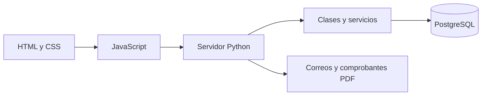

# Arena Castell

Arena Castell es una aplicación web para organizar las reservas de una cancha sintética en Amaguaña. En el mismo sitio también se pueden manejar inscripciones a torneos y a la escuela de fútbol Súper Chaca.

- **Autor:** Johan Vivanco
- **Tipo de proyecto:** trabajo individual
- **Áreas:** Programación Orientada a Objetos, Base de Datos I y Desarrollo Web Frontend UX/UI

## Problema que busca resolver

Cuando las reservas, los pagos y las inscripciones se coordinan solo por llamadas o mensajes, es fácil perder información o repetir horarios. También cuesta revisar quién pagó, qué equipo se inscribió o qué mensualidad está pendiente.

La propuesta reúne esas tareas en una sola página. El cliente puede crear su cuenta, escoger un servicio y revisar su actividad. El administrador tiene un panel para consultar reservas, pagos, mensualidades, ocupación de la cancha y correos enviados.

## Funciones principales

### Para clientes

- Crear una cuenta e iniciar sesión.
- Actualizar nombre, cédula, celular y correo.
- Recuperar la contraseña por correo.
- Consultar horarios y reservar la cancha por hora, para cumpleaños o para eventos.
- Inscribir un equipo cuando exista un torneo abierto.
- Registrar jugadores después de confirmar la inscripción del equipo.
- Inscribir a un alumno en Súper Chaca y renovar mensualidades.
- Elegir transferencia, efectivo en la cancha o tarjeta de crédito/débito.
- Revisar el historial, los avisos y los comprobantes.

### Para el administrador

- Consultar todas las reservas y operaciones.
- Revisar pagos por fechas y exportarlos en CSV.
- Registrar el efectivo recibido en la cancha.
- Consultar mensualidades, ocupación y estado de los correos.
- Ver reportes que juntan información de varias tablas.

## Alcance actual

La página registra los métodos de pago, pero no está conectada a un banco. No solicita números de tarjeta, CVV ni claves bancarias. Las transferencias deben comprobarse por fuera del sistema y el efectivo se confirma desde el panel del administrador.

El proyecto funciona completo cuando `server.py` y PostgreSQL están activos. Si se publica únicamente el HTML en GitHub Pages, se pueden ver las páginas, pero no funcionan las cuentas, las reservas ni los datos de la base.

## Cómo está organizado



El navegador muestra las páginas y `assets/app.js` envía los formularios a la API. `server.py` recibe las solicitudes, `services.py` organiza cada operación y `models.py` contiene las clases y las validaciones principales. `db.py` abre la conexión con PostgreSQL.

| Archivo o carpeta | Uso |
|---|---|
| `index.html` | Página de inicio. |
| `pages/` | Formularios, cuenta, historial y panel de administración. |
| `assets/` | CSS, JavaScript, logo, fotos e imágenes de contacto. |
| `models.py` | Clases, validaciones y cálculos de precios. |
| `services.py` | Registro, reservas, torneos, escuela y pagos. |
| `server.py` | Servidor local y rutas de la API. |
| `db.py` | Conexión con PostgreSQL. |
| `correos.py` | Envío y reintento de correos. |
| `comprobantes.py` | Contenido del correo y comprobantes PDF. |
| `manage.py` | Comandos para revisar la base y crear cuentas de administración. |
| `sql/` | Tablas, restricciones, triggers, procedimiento, vistas y catálogo. |
| `tests/` | Pruebas de Python, SQL, páginas, pagos y correos. |

## Base de datos

La base se llama `arena_castell` y tiene 15 tablas. Las principales guardan usuarios, canchas, torneos, órdenes, reservas, equipos, jugadores, alumnos, mensualidades y pagos. Las demás controlan sesiones, recuperación de contraseña, intentos de acceso y salida de correos.

El diseño separa la información para no repetirla. Por ejemplo, los datos del cliente se guardan una sola vez en `usuarios`, mientras que cada reserva se relaciona con su orden y con la cancha. Los jugadores se guardan en filas separadas y no como una lista dentro del equipo.

La integridad se cuida en varias partes:

- Las claves primarias identifican cada registro y las claves foráneas conectan las tablas.
- `CHECK`, `UNIQUE`, `DEFAULT` y campos obligatorios evitan datos incompletos o duplicados.
- Los triggers controlan cruces de horarios, cupos de torneos, límites de jugadores y pagos.
- El procedimiento `cobrar_mensualidad` registra cuotas de $50 y evita repetir el mismo periodo.
- Las consultas usan parámetros para no mezclar los datos escritos por el usuario con el código SQL.

Hay tres vistas para reportes:

1. `vista_reporte_administrador`: pagos con cliente y servicio.
2. `vista_mensualidades_escuela`: estado de cuotas por alumno.
3. `vista_ocupacion_cancha`: reservas, horas usadas e ingresos por mes.

Los modelos entidad-relación y relacional están en [Diagramas del proyecto](docs/DIAGRAMAS_PROYECTO.md). La instalación detallada está en [Crear la base en pgAdmin](docs/PGADMIN_PASO_A_PASO.md).

## Programación Orientada a Objetos

Las clases de `models.py` se usan dentro del funcionamiento real del proyecto:

- `Usuario` reúne los datos y el manejo de la contraseña.
- `Cliente` y `Administrador` heredan de `Usuario` y cambian sus permisos.
- `ServicioArena` es una clase abstracta que define `calcular_costo()`.
- `ReservaCancha`, `InscripcionTorneo` e `InscripcionSuperChaca` calculan el valor según sus propias reglas.

El encapsulamiento se usa en el hash privado de la contraseña. La herencia aparece en los tipos de usuario y de servicio. La abstracción se encuentra en `ServicioArena`. El polimorfismo permite llamar al mismo método `calcular_costo()` para una reserva, un torneo o la escuela y obtener el resultado correspondiente.

El diagrama completo de clases está junto con los [diagramas del proyecto](docs/DIAGRAMAS_PROYECTO.md).

## Diseño web y experiencia de uso

La apariencia usa negro, gris y tonos plateados tomados del logo. Se mantuvo una sola tipografía y los botones importantes conservan el mismo estilo en todas las páginas.

El diseño se adapta a computadora y celular mediante Grid, Flexbox y reglas `@media`. En pantallas pequeñas el menú cambia de tamaño, las columnas pasan a una sola y las tablas se pueden desplazar sin cortar el contenido.

Los formularios tienen etiquetas, ejemplos y mensajes que explican qué dato se debe corregir. También hay foco visible para navegar con teclado, texto alternativo en imágenes importantes, estructura con `header`, `nav`, `main` y `footer`, y una opción que reduce animaciones cuando el dispositivo lo pide.

Los recorridos mantienen el mismo orden: información, registro de la operación, método de pago y confirmación. Esto ayuda a que el usuario sepa en qué paso está.

## Seguridad y respaldos

- Las contraseñas se guardan como hash y nunca se muestran desde la base.
- Las sesiones duran ocho horas y las cookies son `HttpOnly`.
- Los formularios que cambian datos usan un token CSRF.
- Un cliente solo puede consultar sus propias operaciones.
- Las rutas de administración vuelven a comprobar el rol en Python.
- `.env` está ignorado por Git y no debe compartirse.
- Antes de cambiar tablas se debe crear un respaldo desde pgAdmin.
- Para uso diario conviene conectar la aplicación con un usuario de PostgreSQL con permisos limitados. `sql/permisos.sql` sirve como guía.

El servidor está preparado para trabajo local. Antes de publicarlo en Internet haría falta un alojamiento para Python y PostgreSQL, HTTPS, copias automáticas y una revisión de seguridad.

## Instalación rápida

En Windows y desde la carpeta del proyecto:

```powershell
py -3.14 -m venv .venv
.\.venv\Scripts\python.exe -m pip install -r requirements.txt
```

Después se crea la base, se copia `.env.example` como `.env`, se completa `DATABASE_URL` y se comprueba la conexión:

```powershell
.\.venv\Scripts\python.exe manage.py check-db
.\.venv\Scripts\python.exe manage.py create-admin
.\.venv\Scripts\python.exe server.py
```

La página se abre en [http://127.0.0.1:8765/](http://127.0.0.1:8765/). Todos los pasos, incluido el correo, están explicados en [INICIAR.md](INICIAR.md).

## Pruebas

Las pruebas revisan clases, cédulas, cuentas, permisos, reservas, torneos, escuela, métodos de pago, SQL, páginas y correos. Usan una base temporal separada de `arena_castell`.

```powershell
.\.venv\Scripts\python.exe -m pip install -r requirements-dev.txt
.\.venv\Scripts\python.exe -m pytest -q
```

Las pruebas de correo no envían mensajes reales. Para probar Gmail se usa `manage.py test-email` después de configurar una contraseña de aplicación.

## Control de versiones

El proyecto se desarrolló de forma individual y los cambios se guardaron con Git. El historial de GitHub permite revisar las mejoras de base de datos, pagos, correos, diseño y diagramas. `.gitignore` evita agregar `.env`, el entorno virtual, respaldos y archivos temporales.

Antes de cada commit se revisa `git status` para comprobar qué archivos se van a subir. Si se hace una mejora grande después de la entrega, se puede trabajar en una rama y unirla cuando esté probada. No se presenta una distribución de tareas entre integrantes porque este proyecto tiene un solo autor.

## Documentos del proyecto

- [INICIAR.md](INICIAR.md): instalación, conexión, administrador y correo.
- [Manual de usuario](docs/MANUAL_USUARIO.md): pasos para clientes y administrador.
- [Manual de usuario en PDF](docs/MANUAL_USUARIO.pdf): versión lista para imprimir o presentar.
- [Guía de pgAdmin](docs/PGADMIN_PASO_A_PASO.md): creación y actualización de la base.
- [Diagramas del proyecto](docs/DIAGRAMAS_PROYECTO.md): entidad-relación, modelo relacional y clases POO.
- [PDF de los diagramas](docs/DIAGRAMAS_PROYECTO.pdf): versión lista para presentar.

## Datos importantes para la presentación

- Reserva normal: $27 por hora.
- Evento deportivo: $30 por hora.
- Cumpleaños: paquete de 3 horas por $75.
- Mensualidad de Súper Chaca: $50.
- Pasochoa Cup sexta edición: inscripción de $30, 16 equipos y hasta 20 jugadores.

Estos valores se cargan desde la base. Los importes de órdenes anteriores no cambian cuando se actualiza una tarifa.
