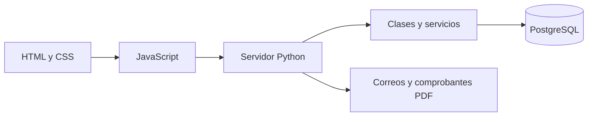

# Arena Castell

Arena Castell es una aplicación web que desarrollé para organizar las reservas de una cancha sintética en Amaguaña. En la misma página también se pueden manejar las inscripciones a torneos y a la escuela de fútbol Súper Chaca.

- **Autor:** Johan Vivanco
- **Tipo de proyecto:** trabajo individual
- **Materias integradas:** Programación Orientada a Objetos, Base de Datos I y Desarrollo Web Frontend UX/UI

## Por qué hice este proyecto

Cuando una cancha organiza todo por llamadas o mensajes, es fácil perder información, repetir un horario o no tener claro quién ya pagó. También se vuelve complicado revisar las inscripciones de los equipos y las mensualidades de la escuela.

Mi idea fue reunir estas tareas en un solo sistema. El cliente puede crear una cuenta, elegir un servicio y consultar su actividad. El administrador tiene su propio panel para revisar reservas, pagos, mensualidades, ocupación de la cancha y correos enviados.

## Encuesta previa

Antes de empezar la página preparé un formulario y lo compartí con un grupo de 20 personas. En la exportación que utilicé para revisar los resultados constan 12 respuestas completas. Eran personas que todavía no habían probado la web, porque el objetivo era conocer qué esperarían encontrar en una página de este tipo.

Las necesidades que más se repitieron fueron consultar horarios disponibles, ver precios claros, evitar la espera por llamadas o mensajes y recibir una confirmación de la reserva. También se pidió información de torneos, categorías y horarios de Súper Chaca, diferentes formas de pago y contacto directo por WhatsApp.

Tomé esas respuestas como guía para decidir las funciones principales. Por eso la página muestra horarios, precios, ubicación, datos de contacto y servicios de la cancha. También permite reservar, inscribir equipos, registrar jugadores, inscribir alumnos, revisar pagos y recibir comprobantes. La mayoría esperaba un estilo oscuro, deportivo y elegante, así que mantuve esos colores junto con la imagen del logo.

No incluí funciones solo porque se vieran llamativas. Primero trabajé en lo que más se repitió en el formulario y en lo que ayuda a completar una reserva o inscripción con menos dudas.

## Qué puede hacer el cliente

- Crear una cuenta e iniciar sesión.
- Actualizar su nombre, cédula, celular y correo.
- Recuperar la contraseña por correo.
- Consultar horarios y reservar la cancha por hora, para eventos o cumpleaños.
- Inscribir un equipo cuando exista un torneo abierto.
- Registrar jugadores después de confirmar la inscripción.
- Inscribir a un alumno en Súper Chaca y renovar mensualidades.
- Elegir transferencia, efectivo en la cancha o tarjeta de crédito/débito.
- Revisar reservas, inscripciones, pagos y comprobantes.

## Qué puede hacer el administrador

- Consultar todas las reservas y operaciones.
- Revisar los pagos por fecha y exportarlos en CSV.
- Registrar el efectivo recibido en la cancha.
- Consultar mensualidades, ocupación y estado de los correos.
- Revisar reportes que reúnen información de varias tablas.

## Alcance actual

Los métodos de pago se registran en el sistema, pero la página no está conectada a un banco. Tampoco solicita números de tarjeta, CVV ni claves bancarias. Las transferencias se verifican por fuera de la aplicación y el efectivo se confirma desde el panel del administrador.

Para que todas las funciones trabajen correctamente deben estar activos `server.py` y PostgreSQL. GitHub Pages permite mostrar los archivos HTML, pero por sí solo no puede ejecutar las cuentas, las reservas ni la conexión con la base de datos.

## Cómo funciona el proyecto



El usuario ve las páginas creadas con HTML y CSS. `assets/app.js` toma los datos de los formularios y los envía a la API. `server.py` recibe las solicitudes, mientras que `services.py` organiza cada operación. Las clases y validaciones principales están en `models.py`, y `db.py` se encarga de abrir la conexión con PostgreSQL.

| Archivo o carpeta | Para qué sirve |
|---|---|
| `index.html` | Página de inicio. |
| `pages/` | Formularios, cuenta, historial y panel de administración. |
| `assets/` | Estilos, JavaScript, logo, fotografías e imágenes de contacto. |
| `models.py` | Clases, validaciones y cálculos. |
| `services.py` | Registro, reservas, torneos, escuela y pagos. |
| `server.py` | Servidor local y rutas de la API. |
| `db.py` | Conexión con PostgreSQL. |
| `correos.py` | Envío y reintento de correos. |
| `comprobantes.py` | Contenido de los correos y comprobantes PDF. |
| `manage.py` | Comandos para revisar la base y crear administradores. |
| `sql/` | Tablas, restricciones, triggers, procedimiento, vistas y catálogo. |
| `tests/` | Pruebas de Python, SQL, páginas, pagos y correos. |

## Base de datos

La base se llama `arena_castell` y tiene 15 tablas. Allí se guardan usuarios, canchas, torneos, órdenes, reservas, equipos, jugadores, alumnos, mensualidades y pagos. Otras tablas controlan las sesiones, la recuperación de contraseñas, los intentos de acceso y la salida de correos.

Separé la información para no repetirla. Por ejemplo, los datos del cliente se guardan una sola vez en `usuarios`. Después, cada orden se relaciona con ese usuario y con el servicio correspondiente. Los jugadores también se guardan por separado y se conectan con su equipo.

Para cuidar la información se utilizan:

- Claves primarias para identificar cada registro.
- Claves foráneas para relacionar las tablas.
- Restricciones `CHECK`, `UNIQUE`, `DEFAULT` y campos obligatorios.
- Triggers que controlan cruces de horarios, cupos, jugadores y pagos.
- El procedimiento `cobrar_mensualidad`, que registra una cuota y evita repetir el mismo periodo.
- Consultas con parámetros para separar los datos escritos por el usuario del código SQL.

También existen tres vistas para los reportes:

1. `vista_reporte_administrador`: muestra pagos junto con el cliente y el servicio.
2. `vista_mensualidades_escuela`: permite revisar las cuotas de cada alumno.
3. `vista_ocupacion_cancha`: resume reservas, horas utilizadas e ingresos por mes.

Los diagramas de entidad-relación y el modelo relacional están en [Diagramas del proyecto](docs/DIAGRAMAS_PROYECTO.md). La creación de la base está explicada en [Crear la base en pgAdmin](docs/PGADMIN_PASO_A_PASO.md).

## Programación Orientada a Objetos

La parte de POO está en `models.py` y sí se utiliza en las operaciones del sistema.

- `Usuario` reúne los datos de la cuenta y el manejo de la contraseña.
- `Cliente` y `Administrador` heredan de `Usuario`, pero tienen permisos distintos.
- `ServicioArena` es una clase abstracta que define `calcular_costo()`.
- `ReservaCancha`, `InscripcionTorneo` e `InscripcionSuperChaca` calculan sus valores según las reglas de cada servicio.

El encapsulamiento se aplica en el hash privado de la contraseña. La herencia aparece en los tipos de usuario y de servicio. `ServicioArena` representa la abstracción. El polimorfismo se observa cuando cada servicio utiliza el mismo método `calcular_costo()`, pero obtiene un resultado diferente.

El diagrama de clases se encuentra junto con los [diagramas del proyecto](docs/DIAGRAMAS_PROYECTO.md).

## Desarrollo web y experiencia de uso

El diseño usa negro, gris y tonos plateados para mantener la identidad del logo. Conservé la misma tipografía y el mismo estilo de botones en todas las páginas para que el sitio se sienta como un solo sistema.

La página se adapta a computadoras y celulares mediante Grid, Flexbox y reglas `@media`. Cuando la pantalla es pequeña, las columnas pasan a una sola, el menú cambia y las tablas se pueden desplazar sin cortar su información.

Los formularios tienen etiquetas, ejemplos y mensajes sencillos cuando un dato necesita corrección. También agregué foco visible para usar el teclado, textos alternativos en las imágenes importantes y etiquetas como `header`, `nav`, `main` y `footer`. Las animaciones se reducen si el dispositivo del usuario lo solicita.

Los procesos mantienen un orden parecido: primero se muestra la información, luego se registra la operación, se escoge el método de pago y finalmente aparece la confirmación. Esta decisión busca que el usuario siempre sepa en qué paso se encuentra.

## Seguridad y respaldos

- Las contraseñas se guardan como hash y no se muestran desde la base.
- Las sesiones duran ocho horas y las cookies son `HttpOnly`.
- Los formularios que modifican datos utilizan un token CSRF.
- Cada cliente solo puede consultar sus propias operaciones.
- Las rutas administrativas vuelven a revisar el rol desde Python.
- `.env` está ignorado por Git y no debe compartirse.
- Antes de cambiar las tablas se recomienda crear un respaldo desde pgAdmin.
- `sql/permisos.sql` sirve como guía para utilizar una cuenta de PostgreSQL con permisos limitados.

El servidor está preparado para ejecutarse de forma local. Para publicarlo completamente en Internet todavía harían falta un alojamiento para Python y PostgreSQL, HTTPS, respaldos automáticos y una revisión de seguridad.

## Cómo iniciar el proyecto

Desde la carpeta del proyecto se crea el entorno virtual y se instalan las dependencias:

```powershell
py -3.14 -m venv .venv
.\.venv\Scripts\python.exe -m pip install -r requirements.txt
```

Después se crea la base, se copia `.env.example` como `.env`, se completa `DATABASE_URL` y se comprueba la conexión:

```powershell
.\.venv\Scripts\python.exe manage.py check-db
.\.venv\Scripts\python.exe manage.py create-admin
.\.venv\Scripts\python.exe server.py
```

La página se abre en [http://127.0.0.1:8765/](http://127.0.0.1:8765/). La explicación completa, incluida la configuración del correo, está en [INICIAR.md](INICIAR.md).

## Pruebas

Las pruebas revisan las clases, cédulas, cuentas, permisos, reservas, torneos, escuela, pagos, SQL, páginas y correos. Para no afectar la información principal se utiliza una base temporal diferente de `arena_castell`.

```powershell
.\.venv\Scripts\python.exe -m pip install -r requirements-dev.txt
.\.venv\Scripts\python.exe -m pytest -q
```

Las pruebas automáticas de correo no envían mensajes reales. Para hacer una prueba con Gmail se usa `manage.py test-email` después de configurar una contraseña de aplicación.

## Git y control de versiones

Este proyecto fue desarrollado de forma individual. Utilicé Git para guardar los cambios y GitHub para mantener el historial. `.gitignore` evita subir `.env`, el entorno virtual, respaldos y archivos temporales.

Antes de cada commit reviso `git status` para comprobar qué archivos se van a subir. No incluyo una distribución de tareas entre integrantes porque el proyecto tiene un solo autor.

## Documentos del proyecto

- [INICIAR.md](INICIAR.md): instalación, conexión, administrador y correo.
- [Manual de usuario](docs/MANUAL_USUARIO.md): uso de la página para clientes y administrador.
- [Manual de usuario en PDF](docs/MANUAL_USUARIO.pdf): versión lista para imprimir.
- [Guía de pgAdmin](docs/PGADMIN_PASO_A_PASO.md): creación y actualización de la base.
- [Diagramas del proyecto](docs/DIAGRAMAS_PROYECTO.md): entidad-relación, modelo relacional y clases POO.
- [PDF de los diagramas](docs/DIAGRAMAS_PROYECTO.pdf): versión lista para presentar.
