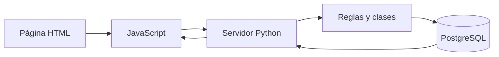
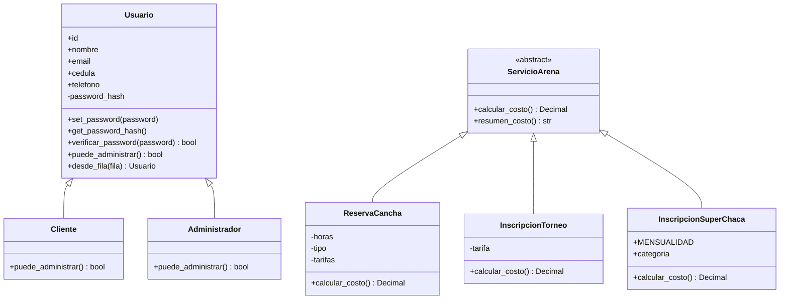

# Cómo funciona el proyecto

La página muestra los formularios, Python revisa las solicitudes y PostgreSQL guarda la información. JavaScript comunica la página con Python sin tener que volver a cargar todo el sitio.

## Qué hace cada archivo

| Archivo | Trabajo que realiza |
|---|---|
| `assets/app.js` | Envía los formularios y muestra los resultados. |
| `server.py` | Recibe las solicitudes y comprueba la sesión. |
| `services.py` | Organiza cada operación: crear una cuenta, reservar o registrar un pago. |
| `models.py` | Contiene las clases, validaciones y cálculos de precio. |
| `db.py` | Abre conexiones con PostgreSQL. |
| `correos.py` | Lee los correos pendientes y los envía por SMTP. |

## Ejemplo de una reserva

El cliente elige fecha, hora y duración. Python calcula el precio con la tarifa guardada en la base y crea una orden pendiente. En ese momento el horario todavía no está ocupado.

Al registrar el pago se vuelve a comprobar el horario. Si está libre, se confirman la reserva y la orden. Si otra persona ocupó el mismo horario, se cancela esa operación completa: no queda un pago separado de una reserva fallida.

El correo se guarda en la misma operación, pero se envía después de que PostgreSQL confirme los cambios. Si falla Gmail, la reserva sigue guardada y el correo queda pendiente de reintento.

## Tablas y relaciones

Hay 15 tablas. El [diagrama de la base](DIAGRAMA_ENTIDAD_RELACION.md) muestra sus campos y relaciones. Usuarios, órdenes, pagos, reservas, equipos y alumnos se guardan por separado.

La clave primaria identifica cada fila. La clave foránea conecta una fila con otra tabla. Por ejemplo, `ordenes.usuario_id` indica quién hizo una operación.

La normalización evita repetir información sin necesidad:

- **Primera forma normal:** cada jugador y cada mensualidad tienen su propia fila; no se guardan listas dentro de un campo.
- **Segunda forma normal:** los datos describen el registro completo al que pertenecen. La relación entre alumno y período identifica una mensualidad.
- **Tercera forma normal:** el teléfono del titular se guarda en usuarios, no en cada reserva. Los datos de la cancha y del torneo tienen sus propias tablas.

La descripción y el monto de una orden se guardan tal como eran al crearla. Así, cambiar una tarifa después no cambia los registros anteriores.

## Reglas principales

| Regla | Dónde se comprueba |
|---|---|
| Cédula de diez dígitos y verificador correcto | Python y la función SQL `validar_cedula`. No consulta el Registro Civil. |
| Reservas de 1 a 6 horas; cumpleaños de 3 horas | Python y las restricciones de reservas; el trigger comprueba el paquete de cumpleaños. |
| Horario de 08:00 a 23:00 y fecha futura hasta 90 días | Trigger `controlar_reserva`. |
| Dos reservas confirmadas no pueden cruzarse | Trigger y restricción de exclusión en PostgreSQL. |
| Cupos de equipos y cierre de inscripciones | Trigger `controlar_cupo_torneo`. |
| Límite de jugadores por torneo | Trigger `limitar_jugadores`. La Copa usa 15; el máximo permitido por el sistema es 20. |
| Alumnos de 4 a 17 años y categoría por edad | Python y restricciones de la inscripción. |
| Mensualidad de $50 sin duplicar el período | Procedimiento `cobrar_mensualidad` y claves únicas. |
| El pago debe coincidir con la orden | Trigger `validar_pago`. |

## Clases de Python

El diagrama resume las clases principales de `models.py`:

`Administrador` y `Cliente` heredan los datos y métodos de `Usuario`. La diferencia de permisos se comprueba con `puede_administrar()`.

La contraseña se guarda como un hash en un atributo privado. `set_password()` prepara ese hash y `verificar_password()` comprueba el acceso. No se devuelve la contraseña al navegador.

`ServicioArena` es una clase abstracta. Reserva, torneo y escuela tienen su propia forma de calcular el costo. `crear_orden()` llama al mismo método, `calcular_costo()`, sin necesitar un cálculo diferente dentro de esa función. Ese es el uso de polimorfismo en el proyecto.

## Reportes y seguridad

Las vistas SQL preparan tres reportes: pagos con su usuario y servicio, mensualidades por alumno y ocupación mensual de la cancha. El panel también consulta las reservas pendientes y el estado de los correos. Su filtro de fechas afecta al reporte de pagos.

El servidor comprueba quién inició sesión antes de devolver datos. Un cliente solo puede consultar sus registros. Ocultar el botón Admin no es la única protección: Python también comprueba el permiso.

Las consultas SQL usan parámetros. Los formularios llevan un token CSRF para comprobar la sesión que los envía. La recuperación de contraseña vence en 30 minutos y solo funciona una vez. Más detalles en [Seguridad y respaldos](SEGURIDAD_Y_RESPALDOS.md).

## Tarifas y duración

Las tarifas se leen de `canchas`: $27 por hora, $30 por hora para eventos y $25 por hora
para cumpleaños. El paquete de cumpleaños dura 3 horas y cuesta $75. El formulario muestra
esa duración y Python y el trigger de reservas la comprueban al crear una reserva.

La actualización de tarifas conserva los importes y las duraciones de las reservas anteriores.
El resumen de Pasochoa Cup está en la página de torneos; no permite pagar inscripciones a una
sexta edición cuya fecha y tarifa todavía no se conocen.
