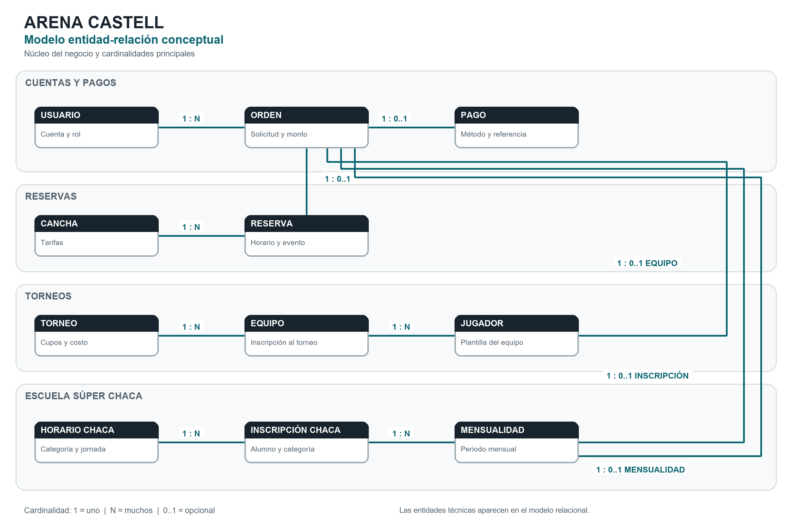
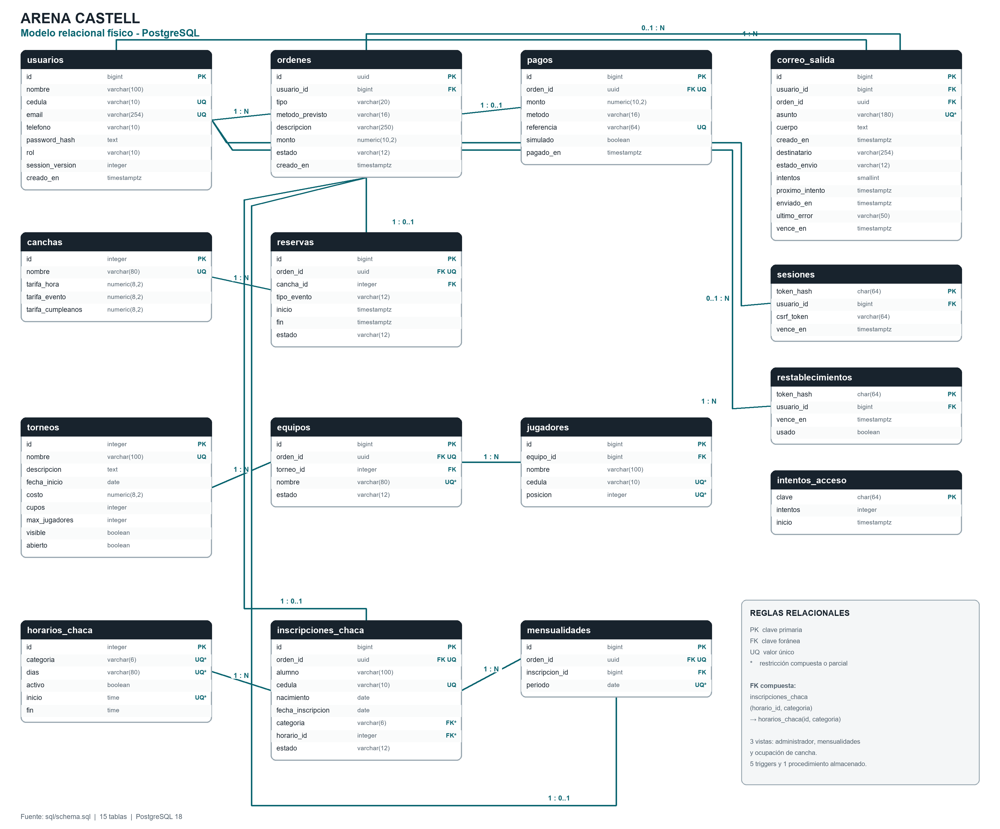
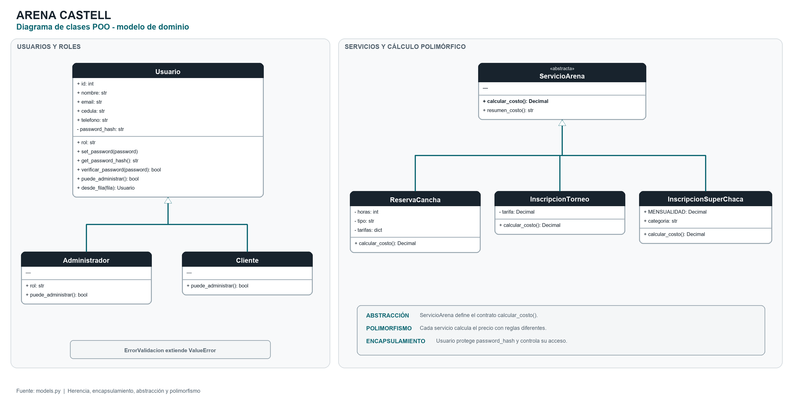

# Diagramas técnicos de Arena Castell

Estos diagramas se generaron a partir de `sql/schema.sql` y `models.py`. Representan la implementación actual del proyecto y sirven como evidencia para Base de Datos I y Programación Orientada a Objetos.

## 1. Modelo entidad-relación

El modelo entidad-relación presenta el núcleo del negocio y sus cardinalidades. `Usuario` es el origen de las órdenes. Cada orden puede materializar una reserva, la inscripción de un equipo, una inscripción de Súper Chaca, una mensualidad o un pago. Las entidades técnicas de correo, sesiones, restablecimiento e intentos de acceso se detallan en el modelo relacional completo.

Archivo editable: [`modelo_entidad_relacion.mmd`](diagramas/modelo_entidad_relacion.mmd).

## 2. Modelo relacional

El modelo relacional muestra las 15 tablas implementadas, sus atributos principales y las claves `PK`, `FK` y `UQ`. La relación entre `inscripciones_chaca` y `horarios_chaca` usa la clave foránea compuesta `(horario_id, categoria)`, con referencia a `(id, categoria)`. Las restricciones `CHECK`, exclusiones, triggers, procedimiento y vistas se documentan en `sql/schema.sql` porque no sustituyen relaciones entre tablas.

Archivo editable: [`modelo_relacional.mmd`](diagramas/modelo_relacional.mmd).

## 3. Diagrama de clases POO

El diagrama evidencia los cuatro pilares usados por el proyecto:

- **Encapsulamiento:** `Usuario` mantiene `password_hash` como atributo privado y controla su acceso mediante métodos.
- **Herencia:** `Administrador` y `Cliente` heredan de `Usuario`; los tres servicios heredan de `ServicioArena`.
- **Abstracción:** `ServicioArena` define el contrato abstracto `calcular_costo()`.
- **Polimorfismo:** `ReservaCancha`, `InscripcionTorneo` e `InscripcionSuperChaca` implementan el mismo método con reglas de precio diferentes.

Archivo editable: [`diagrama_clases_poo.mmd`](diagramas/diagrama_clases_poo.mmd).

## Versiones para entregar

- [`DIAGRAMAS_PROYECTO.pdf`](DIAGRAMAS_PROYECTO.pdf): documento completo listo para presentar o adjuntar.
- Los archivos PNG de `docs/diagramas/` pueden insertarse directamente en Word, PowerPoint o Google Docs.
- Los archivos Mermaid `.mmd` conservan una versión editable y reproducible.

## Fuente y alcance

- Tablas y relaciones: `sql/schema.sql`.
- Clases, atributos y métodos: `models.py`.
- Lógica de aplicación que utiliza las clases: `services.py`.
- Los métodos de pago son registros simulados; el diagrama no representa una pasarela bancaria real.
