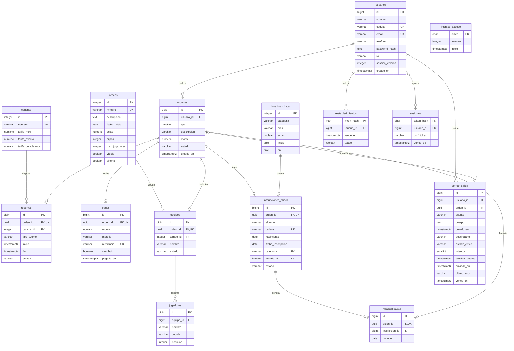

# Tablas y relaciones de la base

Este diagrama muestra las 15 tablas de Arena Castell. Los nombres son los mismos que se usan en los scripts SQL y en Python.

La versión [PDF](DIAGRAMA_ENTIDAD_RELACION.pdf) está separada en cuatro páginas para que se lea mejor: reservas y pagos, torneos, escuela y acceso a la cuenta.

## Cómo leerlo

- **PK:** clave primaria; identifica un registro.
- **FK:** clave foránea; conecta con otra tabla.
- **UK o UQ:** valor o combinación que no se puede repetir.
- **1:N:** un registro puede relacionarse con varios. Por ejemplo, un usuario puede tener varias órdenes.
- **0..1:** la relación es opcional y admite como máximo un registro.

En la escuela, `horario_id` y `categoria` forman una clave foránea compuesta. Esto obliga a elegir un horario de la categoría correcta.

`intentos_acceso` no se conecta a un usuario porque también cuenta intentos antes de iniciar sesión. Las contraseñas se guardan como hash. Los correos de recuperación contienen enlaces de acceso, por eso la base y sus copias deben mantenerse privadas.

Las restricciones completas están en [el script de tablas](../sql/pgadmin/03_tablas_y_relaciones.sql). El diagrama explica las relaciones; no reemplaza los CHECK y triggers de la base.
