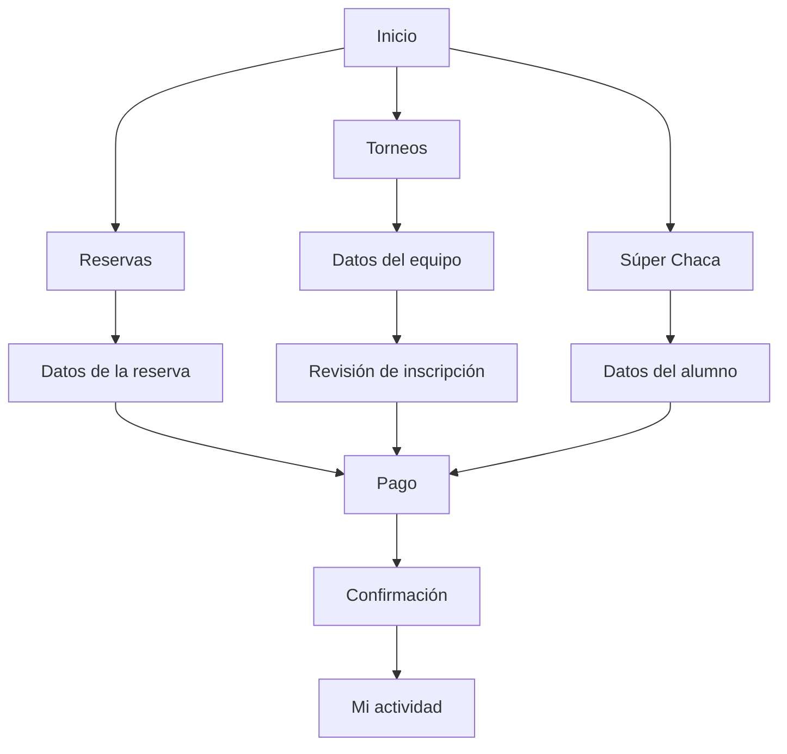

# Páginas del sitio

`index.html` está en la carpeta principal. Las otras 18 páginas están en `pages/`. Los estilos, fotos y JavaScript están en `assets/`.

| Página | Qué contiene |
|---|---|
| `index.html` | Información de la cancha, servicios, contactos y mapa. |
| `reservas.html` | Opciones de reserva por horas, cumpleaños o eventos. |
| `informacion_reservas.html` | Fecha, horario, duración y datos de la reserva. |
| `torneos.html` | Información de los torneos y de la Copa que está en juego. |
| `pagos_torneos.html` | Datos del representante y nombre del equipo. |
| `informacion_torneos_pago.html` | Revisión de la inscripción antes de pagar. |
| `super_chaca.html` | Información, categorías y jornadas de la escuela. |
| `informacion_super_chaca.html` | Datos del alumno, categoría y horario. |
| `pagos.html` | Registro del método de pago de los servicios. |
| `confirmacion.html` | Resultado de la operación y comprobante para imprimir. |
| `iniciar_sesion.html` | Acceso con correo y contraseña. |
| `registrarse.html` | Creación de una cuenta de cliente. |
| `olvide_contrasena.html` | Solicitud de un enlace de recuperación. |
| `restablecer_contrasena.html` | Formulario para establecer la nueva contraseña. |
| `mi_perfil.html` | Consulta y actualización de los datos personales. |
| `mis_reservas_inscripciones.html` | Historial, comprobantes, mensualidades y avisos. |
| `mi_equipo.html` | Lista de jugadores de un equipo inscrito. |
| `admin.html` | Reservas, pagos, operaciones, reportes y estado de los correos. |
| `privacidad.html` | Explicación del uso de los datos personales. |

## Recorridos principales

El menú permite volver al inicio o cambiar de servicio. Después de iniciar sesión aparece Mi actividad. Admin solo aparece para una cuenta con ese permiso; el servidor también lo comprueba.

La Copa actual tiene cerradas sus inscripciones. El recorrido de inscripción se usa cuando haya una convocatoria abierta. Los pagos quedan registrados en la base, sin realizar un cargo bancario.
